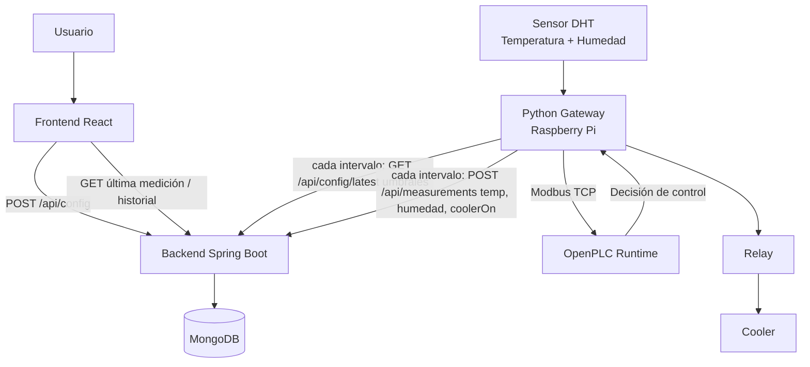
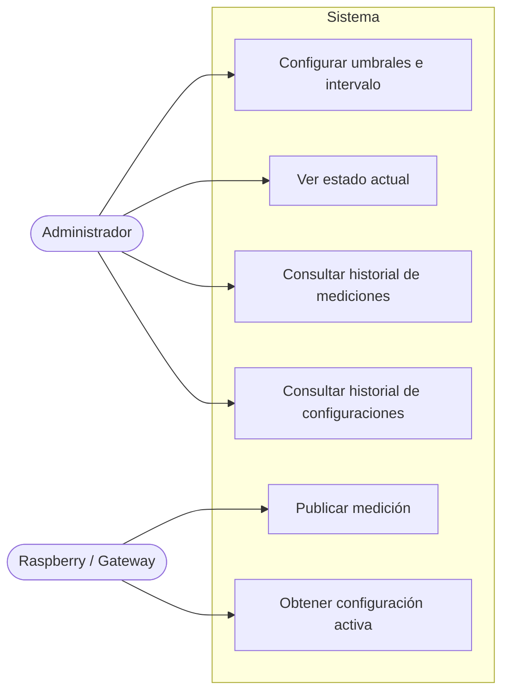
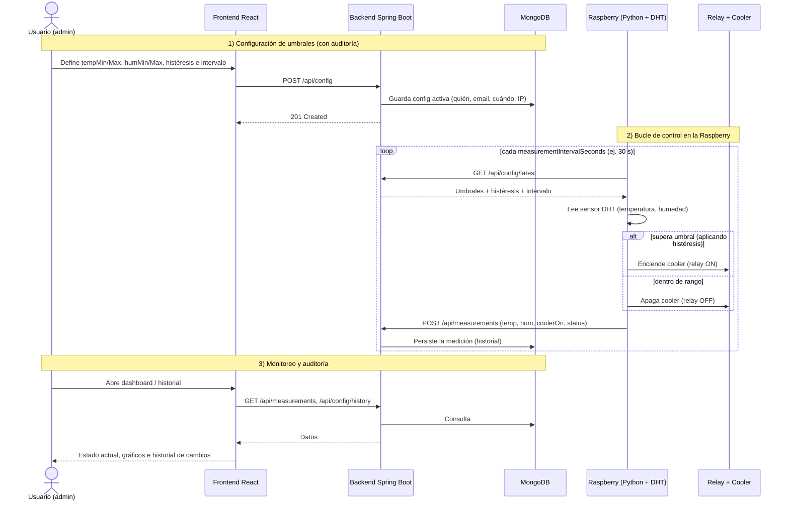
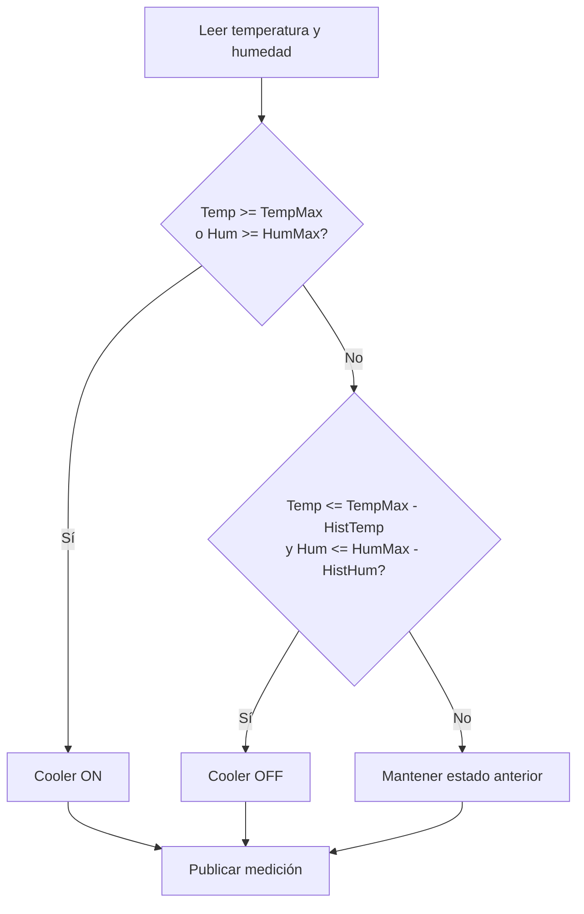
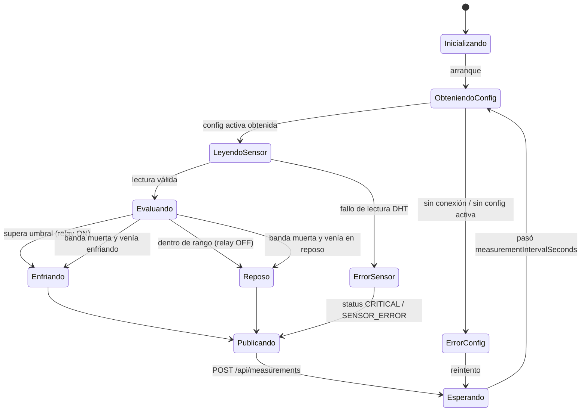
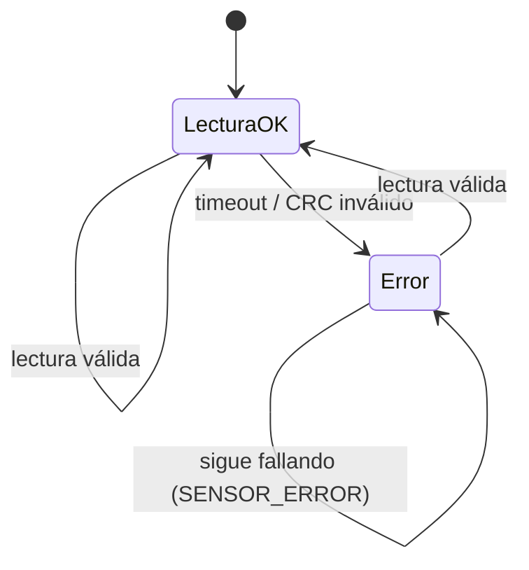
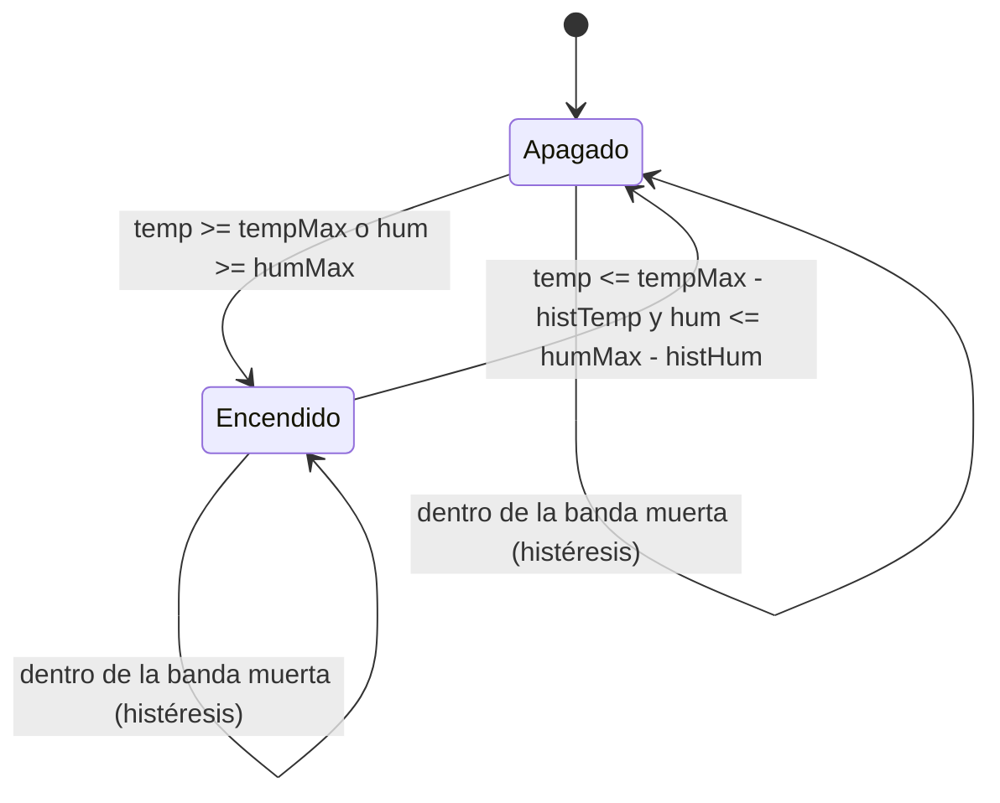
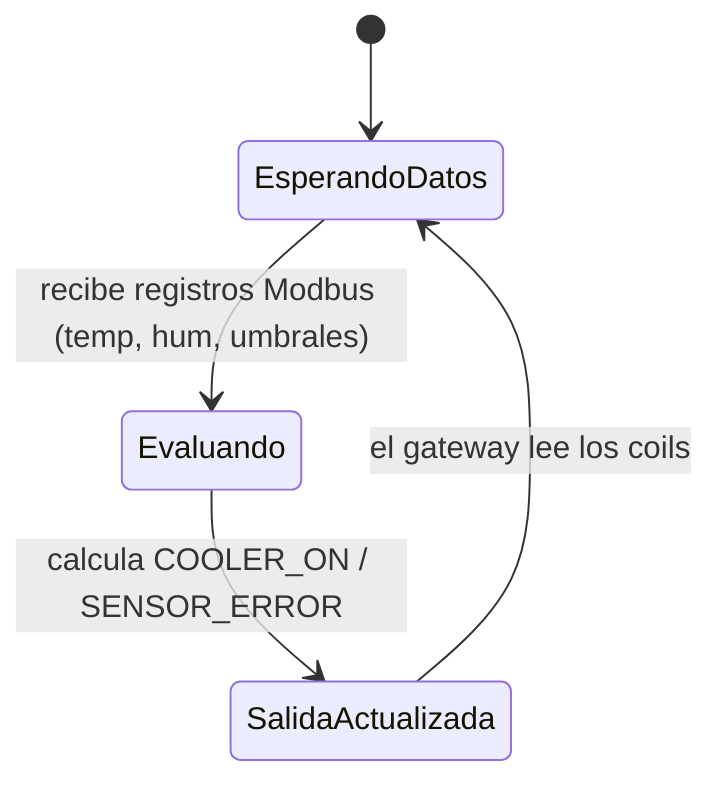

# Backend — Sistema de Control PLC

Backend REST para un sistema de control de temperatura/humedad usando Raspberry Pi 3B+, sensor DHT, OpenPLC, relay, cooler, MongoDB y frontend React.

Java 25 · Spring Boot 3.5 · Spring Data MongoDB · Gradle · arquitectura por capas.

## Qué es y para qué sirve

Este backend forma parte de un sistema de control de clima desarrollado como proyecto de Teoría de Control.

El objetivo del sistema es monitorear temperatura y humedad, permitir la configuración de umbrales desde una interfaz web y registrar el historial de mediciones y configuraciones.

El sistema completo utiliza:

* Raspberry Pi 3B+ para ejecutar la adquisición de datos.
* Sensor DHT para medir temperatura y humedad.
* OpenPLC como controlador lógico.
* Relay para accionar el cooler.
* Cooler como actuador de ventilación.
* Spring Boot como API REST.
* MongoDB como base de datos.
* React como frontend de monitoreo y configuración.

## Arquitectura general



> **Cadencia de la Raspberry**: en cada `measurementIntervalSeconds` (configurable desde el
> frontend, por defecto 30 s) la Raspberry **(1)** consulta `GET /api/config/latest` para
> obtener los umbrales/histéresis vigentes, **(2)** lee el sensor DHT y decide el estado del
> cooler, y **(3)** publica `POST /api/measurements` con la temperatura, la humedad y si el
> cooler quedó encendido. Así el historial se arma a ese ritmo y los cambios de umbral se
> aplican en el siguiente ciclo.

## Responsabilidad de cada componente

| Componente          | Responsabilidad                                                                       |
| ------------------- | ------------------------------------------------------------------------------------- |
| Frontend React      | Permite configurar umbrales, visualizar estado actual, consultar historial y gráficos |
| Spring Boot Backend | Expone la API REST, valida datos, persiste configuraciones y mediciones               |
| MongoDB             | Guarda historial de configuraciones y mediciones                                      |
| Python Gateway      | Lee el sensor DHT, consulta configuración activa y publica mediciones                 |
| OpenPLC             | Ejecuta la lógica de control usando los valores recibidos                             |
| Relay               | Actúa como interruptor eléctrico para el cooler                                       |
| Cooler              | Actuador físico de ventilación                                                        |
| Sensor DHT          | Fuente de medición de temperatura y humedad                                           |

## Casos de uso



| Caso de uso                            | Actor         | Descripción                                                                 | Endpoint                  |
| -------------------------------------- | ------------- | --------------------------------------------------------------------------- | ------------------------- |
| Configurar umbrales e intervalo        | Administrador | Define tempMin/Max, humMin/Max, histéresis e intervalo de medición          | `POST /api/config`        |
| Ver estado actual                      | Administrador | Consulta la última medición y la configuración activa                       | `GET /api/measurements/latest`, `GET /api/config/latest` |
| Consultar historial de mediciones      | Administrador | Lista y filtra mediciones (fecha, estado, rangos, cooler)                   | `GET /api/measurements`   |
| Consultar historial de configuraciones | Administrador | Audita los cambios de umbrales (quién, cuándo, valores)                     | `GET /api/config/history` |
| Obtener configuración activa           | Raspberry     | Lee los umbrales e intervalo vigentes para aplicar el control               | `GET /api/config/latest`  |
| Publicar medición                      | Raspberry     | Envía la lectura del sensor y el estado calculado del cooler                | `POST /api/measurements`  |

### Detalle: configurar umbrales (Administrador)

```text
Actor:          Administrador
Precondición:   El backend y MongoDB están disponibles.
Flujo principal:
  1. El administrador abre la pantalla de Configuración en el frontend.
  2. Carga umbrales, histéresis e intervalo de medición.
  3. El frontend valida (espejo del backend) y envía POST /api/config.
  4. El backend valida, desactiva la config anterior y guarda la nueva como activa.
  5. Queda registrada la auditoría (nombre, email, IP, user-agent, fecha).
Flujos alternativos:
  - Datos inválidos -> 400 con mensajes en español.
  - Demasiadas solicitudes -> 429 (rate limiting).
```

### Detalle: publicar medición (Raspberry)

```text
Actor:          Raspberry / Gateway
Precondición:   Existe una configuración activa.
Flujo principal:
  1. La Raspberry obtiene la config activa (GET /api/config/latest).
  2. Lee el sensor DHT y aplica la lógica de control (histéresis).
  3. Acciona el relay/cooler según el resultado.
  4. Publica la medición (POST /api/measurements) con el estado calculado.
  5. El backend persiste la medición en el historial.
Frecuencia:     cada measurementIntervalSeconds (configurable, por defecto 30 s).
```

## Flujo principal del sistema

```text
1. El usuario ingresa al frontend React.
2. Configura umbrales de temperatura y humedad.
3. React envía la configuración al backend mediante POST /api/config.
4. Spring Boot valida y guarda la configuración activa en MongoDB.
5. Python en la Raspberry consulta la configuración activa con GET /api/config/latest.
6. Python lee temperatura y humedad desde el sensor DHT.
7. Python envía los valores a OpenPLC mediante Modbus TCP.
8. OpenPLC ejecuta la lógica de control.
9. Python obtiene la decisión de OpenPLC y acciona el relay/cooler.
10. Python publica la medición en Spring Boot mediante POST /api/measurements.
11. React consulta dashboard e historial desde el backend.
```

## Qué hace el sistema (diagrama de secuencia)

Este diagrama muestra el ciclo completo: el usuario define los umbrales (y el intervalo de
medición) desde la web, la Raspberry los aplica y, cada cierto intervalo configurable, mide,
decide si prende el cooler y publica la medición; todo queda persistido para auditoría e
historial.



## Rol de OpenPLC

OpenPLC se utiliza como controlador lógico del sistema.

No se conecta directamente a MongoDB. La integración se realiza mediante un gateway en Python que actúa como puente entre:

```text
Sensor DHT / Spring Boot API / OpenPLC / Relay
```

OpenPLC recibe valores como temperatura actual, humedad actual y umbrales configurados. A partir de esos datos, ejecuta la lógica de control y determina si el cooler debe estar encendido o apagado.

## Integración con Modbus TCP

La comunicación entre Python y OpenPLC se realiza mediante Modbus TCP.

Mapa de registros sugerido:

| Registro | Variable        | Descripción                            |
| -------- | --------------- | -------------------------------------- |
| HR0      | TEMP_ACTUAL_X10 | Temperatura actual multiplicada por 10 |
| HR1      | HUM_ACTUAL_X10  | Humedad actual multiplicada por 10     |
| HR2      | TEMP_MIN_X10    | Umbral mínimo de temperatura           |
| HR3      | TEMP_MAX_X10    | Umbral máximo de temperatura           |
| HR4      | HUM_MIN_X10     | Umbral mínimo de humedad               |
| HR5      | HUM_MAX_X10     | Umbral máximo de humedad               |
| HR6      | TEMP_HYST_X10   | Histéresis de temperatura              |
| HR7      | HUM_HYST_X10    | Histéresis de humedad                  |

| Coil | Variable     | Descripción                        |
| ---- | ------------ | ---------------------------------- |
| C0   | COOLER_ON    | Estado calculado del cooler        |
| C1   | SENSOR_ERROR | Indica error de lectura del sensor |

Se utilizan valores multiplicados por 10 para trabajar con enteros en Modbus.

Ejemplo:

```text
25.3 °C → 253
80.9 %  → 809
```

## Lógica de control

La lógica de control utiliza histéresis para evitar que el relay active y desactive el cooler constantemente cerca del umbral.



Regla general:

```text
Si temperatura >= temperatureMax → encender cooler.
Si humedad >= humidityMax → encender cooler.
Si temperatura <= temperatureMax - hysteresisTemperature
y humedad <= humidityMax - hysteresisHumidity → apagar cooler.
```

## Máquina de estados

### Ciclo de control (Raspberry / Gateway)

Estado global del bucle que corre en la Raspberry.



### Sensor DHT



### Relay / Cooler



### OpenPLC



## Modelo de configuración

Se utiliza historial versionado de configuración.

Cada vez que se envía un POST a `/api/config`, se crea un nuevo documento de configuración y se marca como activo. Las configuraciones anteriores quedan desactivadas, pero no se eliminan.

Esto permite auditar:

* quién cambió los umbrales;
* cuándo los cambió;
* desde qué cliente;
* cuáles eran los valores anteriores.

Ejemplo de respuesta de la API (`GET /api/config/latest`):

```json
{
  "id": "665f1c...",
  "temperatureMin": 22.0,
  "temperatureMax": 28.0,
  "humidityMin": 40.0,
  "humidityMax": 90.0,
  "hysteresisTemperature": 1.0,
  "hysteresisHumidity": 2.0,
  "measurementIntervalSeconds": 30,
  "createdByName": "Gabriel Andino",
  "createdByEmail": "gabriel@example.com",
  "active": true,
  "createdAt": "2026-06-03T12:00:00Z"
}
```

> **Datos sensibles**: `clientIp`, `userAgent` y `deviceFingerprint` se usan solo para el
> control anti-abuso y se guardan **únicamente en la base de datos**. No se exponen en la API
> ni se escriben en los logs (los logs de rate limiting registran solo el "bucket", nunca la
> IP/email/fingerprint).

### Intervalo de medición (configurable)

El campo `measurementIntervalSeconds` define **cada cuánto** la Raspberry lee el sensor y
publica una medición. Es parte de la configuración versionada, así que se setea desde el
frontend junto con los umbrales y queda auditado (quién lo cambió y cuándo).

* **Valor por defecto:** 30 segundos.
* **Rango permitido:** 5 a 3600 segundos (validado en el backend).
* La Raspberry obtiene este valor en `GET /api/config/latest` y lo usa como cadencia de su
  bucle. Al cambiarlo desde la web, la próxima vez que la Raspberry relea la config, ajusta
  el intervalo sin necesidad de redeploy.

> Por qué configurable: un intervalo más corto da un historial más fino pero genera más
> escritura/tráfico; uno más largo es más liviano. 30 s es un buen punto de equilibrio para
> la demo. El mínimo de 5 s evita saturar el backend (y es coherente con el rate limiting).

## Modelo de medición

Cada medición representa una lectura enviada por la Raspberry.

El campo `status` es un enum (`SystemStatus`) con los valores:

* `NORMAL` — temperatura y humedad dentro de rango.
* `WARNING_TEMP` — temperatura fuera de umbral.
* `WARNING_HUMIDITY` — humedad fuera de umbral.
* `CRITICAL` — fuera de umbral más allá de la histéresis.

Ejemplo:

```json
{
  "id": "665f1d...",
  "temperature": 29.1,
  "humidity": 78.2,
  "coolerOn": true,
  "relayOn": true,
  "status": "WARNING_TEMP",
  "createdAt": "2026-06-03T12:05:00Z"
}
```

## Seguridad y anti-abuso

El backend incluye validaciones y límites básicos para evitar abuso de los endpoints públicos.

Protecciones implementadas:

* Rate limiting global por IP.
* Rate limiting específico para `POST /api/config`.
* Rate limiting específico para `POST /api/measurements`.
* Blacklist temporal por IP ante exceso de requests.
* Límite máximo de tamaño de request body.
* Validación estricta de rangos de temperatura y humedad.
* CORS restringido a los orígenes configurados.

El objetivo no es implementar autenticación completa, sino proteger una API pública simple contra spam o uso abusivo durante la demo del sistema.

## Ejecutar con Docker

Todo el stack local se puede levantar con:

```bash
docker compose up --build
```

Servicios:

```text
API: http://localhost:8080
Swagger UI: http://localhost:8080/swagger-ui.html
Mongo Express: http://localhost:8081
```

## Datos de prueba

El proyecto incluye un seed inicial para MongoDB con:

* configuraciones históricas (con una activa) y nombres acentuados para probar los filtros;
* ~1300 mediciones con resolución mixta: **densas en las últimas 24 h** (una cada 2 min) y más
  espaciadas hasta 14 días atrás (una cada 30 min);
* la **última medición casi "en vivo"** (timestamp ≈ ahora), para que el badge de salud
  muestre *En línea* apenas reseedeás;
* ciclos de cooler con **histéresis real** (estado arrastrado) y los cuatro estados
  (`NORMAL`, `WARNING_TEMP`, `WARNING_HUMIDITY`, `CRITICAL`).

Así se pueden probar todas las vistas: kiosco y rangos cortos del dashboard (1 h/12 h/24 h),
análisis del rango (promedios, % fuera de rango, duty cycle), timeline del cooler, alertas y
los filtros del historial.

Los timestamps son **relativos al momento del seed**, así que para tener datos frescos hay que
regenerar (el seed solo corre con la base vacía):

```bash
docker compose down -v   # borra el volumen y reseedea con datos hasta "ahora"
docker compose up --build
```

## Reconstruir / limpiar (Docker)

Si cambiás código del backend, hay que **reconstruir la imagen** (si solo hacés
`docker compose up`, sigue corriendo la imagen vieja):

```bash
docker compose up -d --build           # reconstruye lo que cambió y levanta
```

Reconstrucción forzada ignorando la caché de build:

```bash
docker compose build --no-cache backend
docker compose up -d
```

Resetear los datos de Mongo (borra el volumen y vuelve a ejecutar el seed):

```bash
docker compose down -v                  # ⚠️ borra el volumen mongodb_data
docker compose up -d --build
```

Liberar caché del builder de Docker (global, no solo de este proyecto):

```bash
docker builder prune -f
```

> Recordá: `down -v` borra la data (configuraciones y mediciones) y re-seedea; sin `-v` se
> conserva. El frontend con `npm run dev` toma los cambios solo; el backend en Docker no:
> hay que reconstruir.

## Documentación de la API

La referencia completa de endpoints (rutas, parámetros, filtros, esquemas de request/response
y códigos de estado) está documentada con **OpenAPI/Swagger**, generada desde el código:

```text
Swagger UI:        http://localhost:8080/swagger-ui.html
Especificación:    http://localhost:8080/api-docs
```

Ejemplos rápidos de requests y responses: `docs/examples.http`.

## Estado del proyecto

Este backend forma parte de un sistema mayor compuesto por:

```text
Frontend React
Backend Spring Boot
MongoDB
Python Gateway
OpenPLC Runtime
Raspberry Pi 3B+
Sensor DHT
Relay
Cooler
```

La integración con Raspberry/OpenPLC se realiza desde el Python Gateway, mientras que este backend se encarga de persistir configuración, historial y exponer la API REST para el frontend.
