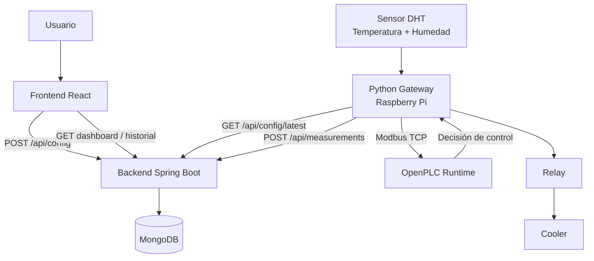
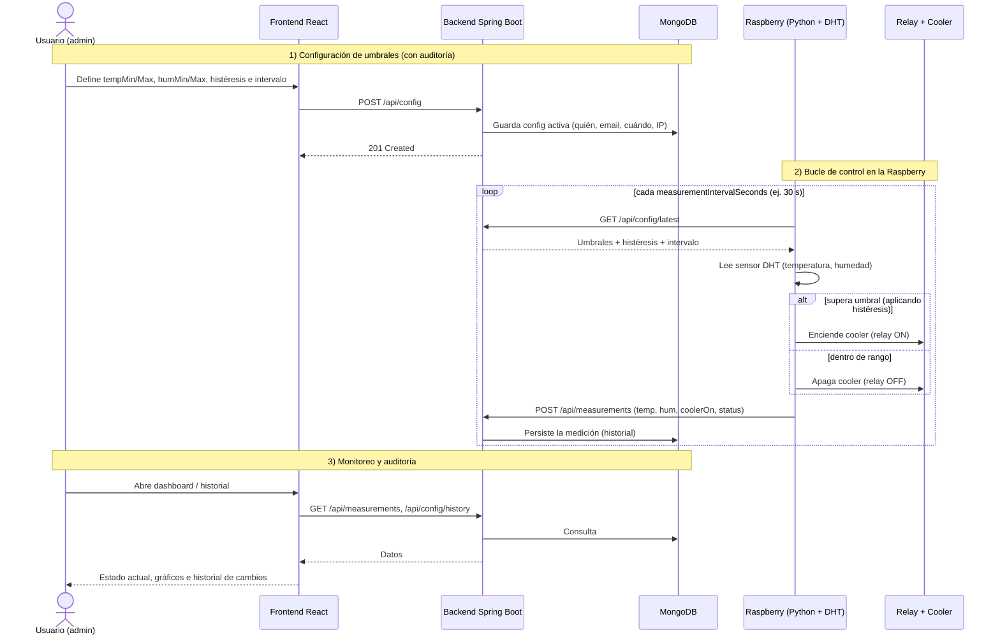
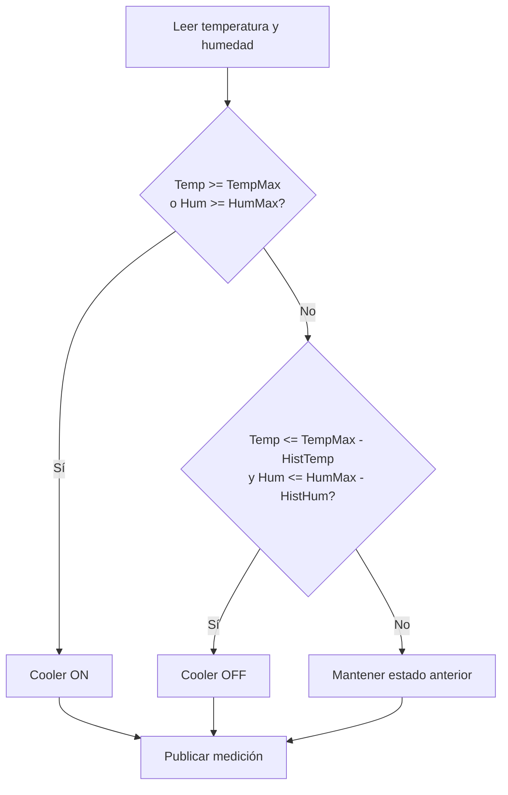

# Backend — Sistema de Control PLC

Backend REST para un sistema de control de temperatura/humedad usando Raspberry Pi 3B+, sensor DHT, OpenPLC, relay, cooler, MongoDB y frontend React.

Java 25 · Spring Boot 3.5 · Spring Data MongoDB · Gradle · arquitectura por capas.

## Qué es y para qué sirve

Este backend forma parte de un sistema de control de clima desarrollado como proyecto de Teoría de Control.

El objetivo del sistema es monitorear temperatura y humedad, permitir la configuración de umbrales desde una interfaz web y registrar el historial de mediciones y configuraciones.

El sistema completo utiliza:

* Raspberry Pi 3B+ para ejecutar la adquisición de datos.
* Sensor DHT para medir temperatura y humedad.
* OpenPLC como controlador lógico.
* Relay para accionar el cooler.
* Cooler como actuador de ventilación.
* Spring Boot como API REST.
* MongoDB como base de datos.
* React como frontend de monitoreo y configuración.

## Arquitectura general



## Responsabilidad de cada componente

| Componente          | Responsabilidad                                                                       |
| ------------------- | ------------------------------------------------------------------------------------- |
| Frontend React      | Permite configurar umbrales, visualizar estado actual, consultar historial y gráficos |
| Spring Boot Backend | Expone la API REST, valida datos, persiste configuraciones y mediciones               |
| MongoDB             | Guarda historial de configuraciones y mediciones                                      |
| Python Gateway      | Lee el sensor DHT, consulta configuración activa y publica mediciones                 |
| OpenPLC             | Ejecuta la lógica de control usando los valores recibidos                             |
| Relay               | Actúa como interruptor eléctrico para el cooler                                       |
| Cooler              | Actuador físico de ventilación                                                        |
| Sensor DHT          | Fuente de medición de temperatura y humedad                                           |

## Flujo principal del sistema

```text
1. El usuario ingresa al frontend React.
2. Configura umbrales de temperatura y humedad.
3. React envía la configuración al backend mediante POST /api/config.
4. Spring Boot valida y guarda la configuración activa en MongoDB.
5. Python en la Raspberry consulta la configuración activa con GET /api/config/latest.
6. Python lee temperatura y humedad desde el sensor DHT.
7. Python envía los valores a OpenPLC mediante Modbus TCP.
8. OpenPLC ejecuta la lógica de control.
9. Python obtiene la decisión de OpenPLC y acciona el relay/cooler.
10. Python publica la medición en Spring Boot mediante POST /api/measurements.
11. React consulta dashboard e historial desde el backend.
```

## Qué hace el sistema (diagrama de secuencia)

Este diagrama muestra el ciclo completo: el usuario define los umbrales (y el intervalo de
medición) desde la web, la Raspberry los aplica y, cada cierto intervalo configurable, mide,
decide si prende el cooler y publica la medición; todo queda persistido para auditoría e
historial.



## Rol de OpenPLC

OpenPLC se utiliza como controlador lógico del sistema.

No se conecta directamente a MongoDB. La integración se realiza mediante un gateway en Python que actúa como puente entre:

```text
Sensor DHT / Spring Boot API / OpenPLC / Relay
```

OpenPLC recibe valores como temperatura actual, humedad actual y umbrales configurados. A partir de esos datos, ejecuta la lógica de control y determina si el cooler debe estar encendido o apagado.

## Integración con Modbus TCP

La comunicación entre Python y OpenPLC se realiza mediante Modbus TCP.

Mapa de registros sugerido:

| Registro | Variable        | Descripción                            |
| -------- | --------------- | -------------------------------------- |
| HR0      | TEMP_ACTUAL_X10 | Temperatura actual multiplicada por 10 |
| HR1      | HUM_ACTUAL_X10  | Humedad actual multiplicada por 10     |
| HR2      | TEMP_MIN_X10    | Umbral mínimo de temperatura           |
| HR3      | TEMP_MAX_X10    | Umbral máximo de temperatura           |
| HR4      | HUM_MIN_X10     | Umbral mínimo de humedad               |
| HR5      | HUM_MAX_X10     | Umbral máximo de humedad               |
| HR6      | TEMP_HYST_X10   | Histéresis de temperatura              |
| HR7      | HUM_HYST_X10    | Histéresis de humedad                  |

| Coil | Variable     | Descripción                        |
| ---- | ------------ | ---------------------------------- |
| C0   | COOLER_ON    | Estado calculado del cooler        |
| C1   | SENSOR_ERROR | Indica error de lectura del sensor |

Se utilizan valores multiplicados por 10 para trabajar con enteros en Modbus.

Ejemplo:

```text
25.3 °C → 253
80.9 %  → 809
```

## Lógica de control

La lógica de control utiliza histéresis para evitar que el relay active y desactive el cooler constantemente cerca del umbral.



Regla general:

```text
Si temperatura >= temperatureMax → encender cooler.
Si humedad >= humidityMax → encender cooler.
Si temperatura <= temperatureMax - hysteresisTemperature
y humedad <= humidityMax - hysteresisHumidity → apagar cooler.
```

## Stack

* Java 25
* Spring Boot 3.5
* Spring Web
* Spring Validation
* Spring Data MongoDB
* MongoDB 7
* Gradle Kotlin DSL
* Lombok
* MapStruct
* Apache Commons Lang3
* springdoc-openapi
* Rate limiting en memoria

## Estructura del proyecto

```text
src/main/java/com/control/system/
├── ControlSystemApplication.java
├── domain/
│   ├── entity/        # Config, Measurement
│   └── enums/         # SystemStatus
├── mapping/           # Mappers MapStruct
├── repository/
│   ├── *Repository
│   ├── *RepositoryImpl
│   ├── filter/
│   └── support/
├── service/           # Lógica de negocio
├── web/
│   ├── controller/    # REST controllers
│   ├── dto/
│   │   ├── request/
│   │   └── response/
│   └── exception/
└── infrastructure/
    ├── config/        # CORS, OpenAPI
    ├── ratelimit/     # Rate limiting en memoria
    └── web/           # Filtros HTTP y resolución de cliente
```

## Modelo de configuración

Se utiliza historial versionado de configuración.

Cada vez que se envía un POST a `/api/config`, se crea un nuevo documento de configuración y se marca como activo. Las configuraciones anteriores quedan desactivadas, pero no se eliminan.

Esto permite auditar:

* quién cambió los umbrales;
* cuándo los cambió;
* desde qué cliente;
* cuáles eran los valores anteriores.

Ejemplo:

```json
{
  "id": "665f1c...",
  "temperatureMin": 22.0,
  "temperatureMax": 28.0,
  "humidityMin": 40.0,
  "humidityMax": 90.0,
  "hysteresisTemperature": 1.0,
  "hysteresisHumidity": 2.0,
  "measurementIntervalSeconds": 30,
  "createdByName": "Gabriel Andino",
  "createdByEmail": "gabriel@example.com",
  "clientIp": "192.168.1.10",
  "userAgent": "Mozilla/5.0",
  "deviceFingerprint": "optional-client-id",
  "active": true,
  "createdAt": "2026-06-03T12:00:00Z"
}
```

### Intervalo de medición (configurable)

El campo `measurementIntervalSeconds` define **cada cuánto** la Raspberry lee el sensor y
publica una medición. Es parte de la configuración versionada, así que se setea desde el
frontend junto con los umbrales y queda auditado (quién lo cambió y cuándo).

* **Valor por defecto:** 30 segundos.
* **Rango permitido:** 5 a 3600 segundos (validado en el backend).
* La Raspberry obtiene este valor en `GET /api/config/latest` y lo usa como cadencia de su
  bucle. Al cambiarlo desde la web, la próxima vez que la Raspberry relea la config, ajusta
  el intervalo sin necesidad de redeploy.

> Por qué configurable: un intervalo más corto da un historial más fino pero genera más
> escritura/tráfico; uno más largo es más liviano. 30 s es un buen punto de equilibrio para
> la demo. El mínimo de 5 s evita saturar el backend (y es coherente con el rate limiting).

## Modelo de medición

Cada medición representa una lectura enviada por la Raspberry.

Ejemplo:

```json
{
  "id": "665f1d...",
  "temperature": 25.4,
  "humidity": 78.2,
  "coolerOn": true,
  "relayOn": true,
  "status": "COOLING",
  "createdAt": "2026-06-03T12:05:00Z"
}
```

## Endpoints

### Configuración

| Método | Ruta                  | Descripción                                      |
| ------ | --------------------- | ------------------------------------------------ |
| POST   | `/api/config`         | Crea una nueva configuración activa              |
| GET    | `/api/config/latest`  | Obtiene la configuración activa actual           |
| GET    | `/api/config/history` | Obtiene el historial paginado de configuraciones |

Filtros disponibles:

```text
/api/config/history?from=&to=&createdByName=&createdByEmail=&page=&size=&sort=
```

### Mediciones

| Método | Ruta                          | Descripción                               |
| ------ | ----------------------------- | ----------------------------------------- |
| POST   | `/api/measurements`           | Registra una nueva medición               |
| GET    | `/api/measurements/latest`    | Obtiene la última medición                |
| GET    | `/api/measurements`           | Obtiene mediciones paginadas              |
| GET    | `/api/measurements/dashboard` | Obtiene datos resumidos para el dashboard |

Filtros disponibles:

```text
/api/measurements?from=&to=&status=&temperatureMin=&temperatureMax=&humidityMin=&humidityMax=&coolerOn=&page=&size=&sort=
```

## Dashboard

El endpoint de dashboard devuelve la información necesaria para la vista principal del frontend.

Ejemplo de respuesta:

```json
{
  "latestMeasurement": {
    "temperature": 25.4,
    "humidity": 78.2,
    "coolerOn": true,
    "status": "COOLING",
    "createdAt": "2026-06-03T12:05:00Z"
  },
  "activeConfig": {
    "temperatureMin": 22.0,
    "temperatureMax": 28.0,
    "humidityMin": 40.0,
    "humidityMax": 90.0,
    "hysteresisTemperature": 1.0,
    "hysteresisHumidity": 2.0
  },
  "measurementsLast24h": []
}
```

## Seguridad y anti-abuso

El backend incluye validaciones y límites básicos para evitar abuso de los endpoints públicos.

Protecciones implementadas:

* Rate limiting global por IP.
* Rate limiting específico para `POST /api/config`.
* Rate limiting específico para `POST /api/measurements`.
* Blacklist temporal por IP ante exceso de requests.
* Límite máximo de tamaño de request body.
* Validación estricta de rangos de temperatura y humedad.
* CORS restringido a los orígenes configurados.

El objetivo no es implementar autenticación completa, sino proteger una API pública simple contra spam o uso abusivo durante la demo del sistema.

## Validaciones principales

### Configuración

* `temperatureMin` debe ser menor que `temperatureMax`.
* `humidityMin` debe ser menor que `humidityMax`.
* `hysteresisTemperature` debe ser mayor a 0.
* `hysteresisHumidity` debe ser mayor a 0.
* La temperatura debe estar en un rango razonable.
* La humedad debe estar entre 0 y 100.
* `createdByName` y `createdByEmail` son obligatorios.

### Mediciones

* `temperature` es obligatoria.
* `humidity` es obligatoria.
* `humidity` debe estar entre 0 y 100.
* `coolerOn` indica el estado calculado del actuador.
* `status` representa el estado general del sistema.

## Ejecutar con Docker

Todo el stack local se puede levantar con:

```bash
docker compose up --build
```

Servicios:

```text
API: http://localhost:8080
Swagger UI: http://localhost:8080/swagger-ui.html
Mongo Express: http://localhost:8081
```

## Datos de prueba

El proyecto incluye un seed inicial para MongoDB con:

* configuraciones históricas;
* una configuración activa;
* mediciones simuladas de temperatura y humedad;
* estados derivados del cooler.

Para regenerar los datos:

```bash
docker compose down -v
docker compose up --build
```

## Ejecutar sin Docker

### 1. Levantar MongoDB

```bash
docker compose up -d mongodb
```

### 2. Ejecutar la aplicación

```bash
./gradlew bootRun
```

En Windows:

```bash
.\gradlew.bat bootRun
```

La API queda disponible en:

```text
http://localhost:8080
```

## Variables de entorno

| Variable       | Default                                   | Descripción                            |
| -------------- | ----------------------------------------- | -------------------------------------- |
| `MONGODB_URI`  | `mongodb://localhost:27017/controlsystem` | Cadena de conexión de MongoDB          |
| `CORS_ORIGINS` | `http://localhost:5173`                   | Orígenes permitidos separados por coma |

## Documentación de la API

Swagger UI queda disponible en:

```text
http://localhost:8080/swagger-ui.html
```

Ejemplos de requests y responses:

```text
docs/examples.http
```

## Estado del proyecto

Este backend forma parte de un sistema mayor compuesto por:

```text
Frontend React
Backend Spring Boot
MongoDB
Python Gateway
OpenPLC Runtime
Raspberry Pi 3B+
Sensor DHT
Relay
Cooler
```

La integración con Raspberry/OpenPLC se realiza desde el Python Gateway, mientras que este backend se encarga de persistir configuración, historial y exponer la API REST para el frontend.
