# Backend — Sistema de Control PLC

Backend REST para un sistema de control de temperatura/humedad usando Raspberry Pi 3B+, sensor DHT, OpenPLC, relay, cooler, MongoDB y frontend React.

Java 25 · Spring Boot 3.5 · Spring Data MongoDB · Gradle · arquitectura por capas.

## Contenido

- [Qué es y para qué sirve](#qué-es-y-para-qué-sirve)
- [Diagramas UML incluidos](#diagramas-uml-incluidos)
- [Arquitectura general](#arquitectura-general)
- [Vista de arquitectura C4 (contenedores)](#vista-de-arquitectura-c4-contenedores)
- [Responsabilidad de cada componente](#responsabilidad-de-cada-componente)
- [Casos de uso](#casos-de-uso)
- [Flujo principal del sistema](#flujo-principal-del-sistema)
- [Qué hace el sistema (diagrama de secuencia)](#qué-hace-el-sistema-diagrama-de-secuencia)
- [Rol de OpenPLC](#rol-de-openplc)
- [Integración con Modbus TCP](#integración-con-modbus-tcp)
- [Lógica de control](#lógica-de-control)
- [Máquina de estados](#máquina-de-estados)
- [Modelo de configuración](#modelo-de-configuración)
- [Modelo de medición](#modelo-de-medición)
- [Eventos y alarmas (derivados)](#eventos-y-alarmas-derivados)
- [Modelo de datos (UML)](#modelo-de-datos-uml)
- [Arquitectura por capas (UML)](#arquitectura-por-capas-uml)
- [Diagrama de paquetes (UML)](#diagrama-de-paquetes-uml)
- [Diagrama de despliegue (UML)](#diagrama-de-despliegue-uml)
- [Decisiones de arquitectura (ADR)](#decisiones-de-arquitectura-adr)
- [Seguridad y anti-abuso](#seguridad-y-anti-abuso)
- [Tiempo real (SSE)](#tiempo-real-sse)
- [Ejecutar con Docker](#ejecutar-con-docker)
- [Despliegue (producción)](#despliegue-producción)
- [Variables de entorno](#variables-de-entorno)
- [Datos de prueba](#datos-de-prueba)
- [Reconstruir / limpiar (Docker)](#reconstruir--limpiar-docker)
- [Documentación de la API](#documentación-de-la-api)
- [Estado del proyecto](#estado-del-proyecto)

## Qué es y para qué sirve

Este backend forma parte de un sistema de control de clima desarrollado como proyecto de Teoría de Control.

El objetivo del sistema es monitorear temperatura y humedad, permitir la configuración de umbrales desde una interfaz web y registrar el historial de mediciones y configuraciones.

El sistema completo utiliza:

* Raspberry Pi 3B+ para ejecutar la adquisición de datos.
* Sensor DHT para medir temperatura y humedad.
* OpenPLC como controlador lógico.
* Relay para accionar el cooler.
* Cooler como actuador de ventilación.
* Spring Boot como API REST.
* MongoDB como base de datos.
* React como frontend de monitoreo y configuración.

## Diagramas UML incluidos

Este README documenta el sistema con los diagramas de **UML 2.x** que aplican a un sistema de
control con adquisición, persistencia y una interfaz web. Cobertura por vista (estructural y de
comportamiento):

| Diagrama UML | Vista | Sección |
| --- | --- | --- |
| **Casos de uso** | Comportamiento | [Casos de uso](#casos-de-uso) |
| **Secuencia** | Comportamiento (interacción) | [Diagrama de secuencia](#qué-hace-el-sistema-diagrama-de-secuencia) |
| **Actividad** | Comportamiento (flujo: ciclo de control + end-to-end con swimlanes) | [Lógica de control](#lógica-de-control) · [Flujo principal](#flujo-principal-del-sistema) |
| **Máquina de estados** | Comportamiento (×4: ciclo, sensor, relay, OpenPLC) | [Máquina de estados](#máquina-de-estados) |
| **Tiempos** | Comportamiento (respuesta temporal del control) | [Lógica de control](#lógica-de-control) |
| **Clases** | Estructural | [Modelo de datos (UML)](#modelo-de-datos-uml) |
| **Objetos** | Estructural (instancias) | [Modelo de datos (UML)](#modelo-de-datos-uml) |
| **Componentes** | Estructural | [Arquitectura por capas (UML)](#arquitectura-por-capas-uml) |
| **Paquetes** | Estructural | [Diagrama de paquetes (UML)](#diagrama-de-paquetes-uml) |
| **Despliegue** | Estructural (topología física) | [Diagrama de despliegue (UML)](#diagrama-de-despliegue-uml) |

> **Notación.** Todos los diagramas UML están hechos en **PlantUML** con notación formal (actores y
> óvalos en casos de uso, nodos 3D y artefactos en despliegue, estereotipos, etc.). Usan un estilo
> **neutro (blanco y negro)** para que se lean bien también **impresos en escala de grises**.
> Solo el *diagrama de arquitectura general* (contexto, no UML) y el *flujo de derivación de eventos*
> se mantienen en Mermaid por ser informales. Como complemento moderno a UML se incluye además una
> [vista de arquitectura **C4**](#vista-de-arquitectura-c4-contenedores) (nivel contenedores).
>
> **Formatos y descarga.** Cada diagrama vive en [`docs/uml/`](docs/uml) en tres formatos, todos
> descargables desde el repo: **`.puml`** (fuente editable, exportable desde cualquier herramienta
> PlantUML — VS Code, IntelliJ, plantuml.com), **`.svg`** (el que se muestra en este README) y
> **`.png`** (listo para **pegar en un documento** e imprimir). Un clic en cualquier diagrama abre
> su `.puml`.

## Arquitectura general


> **Cadencia de la Raspberry**: en cada `measurementIntervalSeconds` (configurable desde el
> frontend, por defecto 30 s) la Raspberry **(1)** consulta `GET /api/config/latest` para
> obtener los umbrales/histéresis vigentes, **(2)** lee el sensor DHT y decide el estado del
> cooler, y **(3)** publica `POST /api/measurements` con la temperatura, la humedad y si el
> cooler quedó encendido. Así el historial se arma a ese ritmo y los cambios de umbral se
> aplican en el siguiente ciclo.

## Vista de arquitectura C4 (contenedores)

Además de las vistas UML, se incluye el **modelo C4** (Simon Brown), la práctica actual para
documentar arquitectura de software, que **complementa** a UML (no lo reemplaza). Se muestran los dos
primeros niveles: **contexto** (nivel 1) y **contenedores** (nivel 2).

**Nivel 1 — Contexto:** el sistema, el actor y lo que controla.

[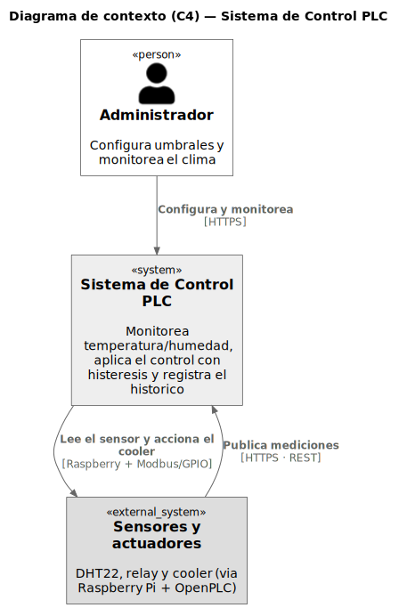](docs/uml/c4_context.puml)

**Nivel 2 — Contenedores:** las piezas desplegables (SPA, backend, base) y su relación con la planta
(gateway + OpenPLC) y el hardware.

[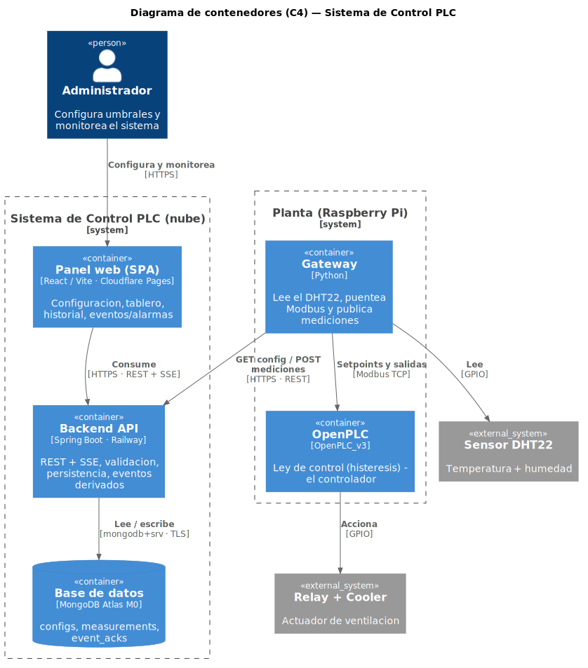](docs/uml/c4_container.puml)

**Nivel 3 — Componentes:** *zoom* dentro del backend (controllers → services → repositorios → base).

[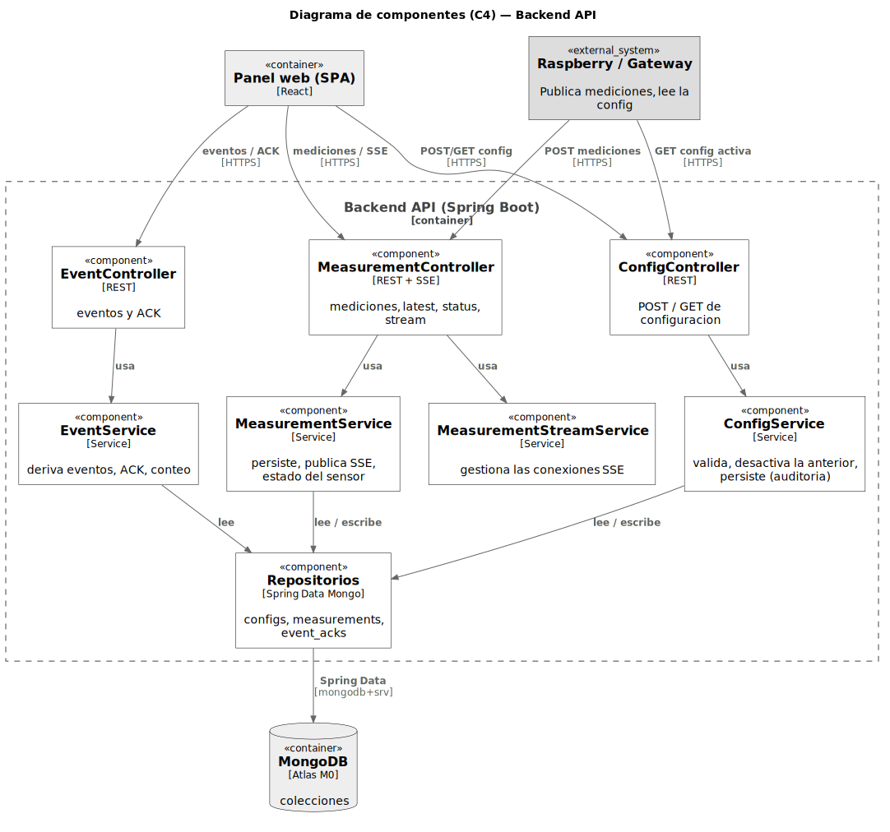](docs/uml/c4_component.puml)

## Responsabilidad de cada componente

| Componente          | Responsabilidad                                                                       |
| ------------------- | ------------------------------------------------------------------------------------- |
| Frontend React      | Permite configurar umbrales, visualizar estado actual, consultar historial y gráficos |
| Spring Boot Backend | Expone la API REST, valida datos, persiste configuraciones y mediciones               |
| MongoDB             | Guarda historial de configuraciones y mediciones                                      |
| Python Gateway      | Lee el sensor DHT, consulta configuración activa y publica mediciones                 |
| OpenPLC             | Ejecuta la lógica de control usando los valores recibidos                             |
| Relay               | Actúa como interruptor eléctrico para el cooler                                       |
| Cooler              | Actuador físico de ventilación                                                        |
| Sensor DHT          | Fuente de medición de temperatura y humedad                                           |

## Casos de uso

[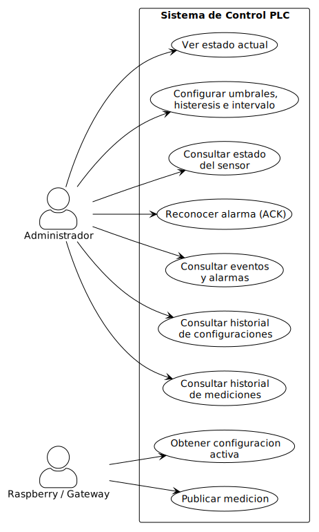](docs/uml/use_cases.puml)

| Caso de uso                            | Actor         | Descripción                                                                 | Endpoint                  |
| -------------------------------------- | ------------- | --------------------------------------------------------------------------- | ------------------------- |
| Configurar umbrales e intervalo        | Administrador | Define tempMin/Max, humMin/Max, histéresis e intervalo de medición          | `POST /api/config`        |
| Ver estado actual                      | Administrador | Consulta la última medición y la configuración activa                       | `GET /api/measurements/latest`, `GET /api/config/latest` |
| Consultar historial de mediciones      | Administrador | Lista y filtra mediciones (fecha, estado, rangos, cooler)                   | `GET /api/measurements`   |
| Consultar historial de configuraciones | Administrador | Audita los cambios de umbrales (quién, cuándo, valores)                     | `GET /api/config/history` |
| Obtener configuración activa           | Raspberry     | Lee los umbrales e intervalo vigentes para aplicar el control               | `GET /api/config/latest`  |
| Publicar medición                      | Raspberry     | Envía la lectura del sensor y el estado calculado del cooler                | `POST /api/measurements`  |
| Consultar eventos y alarmas            | Administrador | Lista paginada de eventos derivados (transiciones de estado y del cooler)   | `GET /api/events`         |
| Reconocer alarma (ACK)                 | Administrador | Marca alarmas como reconocidas (una o todas); conteo global sin reconocer   | `POST /api/events/{id}/ack`, `POST /api/events/ack-all` |
| Consultar estado del sensor            | Administrador | Indica si la Raspberry sigue publicando (online/offline) y la antigüedad del dato | `GET /api/measurements/status`  |

### Detalle: configurar umbrales (Administrador)

```text
Actor:          Administrador
Precondición:   El backend y MongoDB están disponibles.
Flujo principal:
  1. El administrador abre la pantalla de Configuración en el frontend.
  2. Carga umbrales, histéresis e intervalo de medición.
  3. El frontend valida (espejo del backend) y envía POST /api/config.
  4. El backend valida, desactiva la config anterior y guarda la nueva como activa.
  5. Queda registrada la auditoría (nombre, email, IP, user-agent, fecha).
Flujos alternativos:
  - Datos inválidos -> 400 con mensajes en español.
  - Demasiadas solicitudes -> 429 (rate limiting).
```

### Detalle: publicar medición (Raspberry)

```text
Actor:          Raspberry / Gateway
Precondición:   Existe una configuración activa.
Flujo principal:
  1. La Raspberry obtiene la config activa (GET /api/config/latest).
  2. Lee el sensor DHT y aplica la lógica de control (histéresis).
  3. Acciona el relay/cooler según el resultado.
  4. Publica la medición (POST /api/measurements) con el estado calculado.
  5. El backend persiste la medición en el historial.
Frecuencia:     cada measurementIntervalSeconds (configurable, por defecto 30 s).
```

## Flujo principal del sistema

```text
1. El usuario ingresa al frontend React.
2. Configura umbrales de temperatura y humedad.
3. React envía la configuración al backend mediante POST /api/config.
4. Spring Boot valida y guarda la configuración activa en MongoDB.
5. Python en la Raspberry consulta la configuración activa con GET /api/config/latest.
6. Python lee temperatura y humedad desde el sensor DHT.
7. Python envía los valores a OpenPLC mediante Modbus TCP.
8. OpenPLC ejecuta la lógica de control.
9. Python obtiene la decisión de OpenPLC y acciona el relay/cooler.
10. Python publica la medición en Spring Boot mediante POST /api/measurements.
11. React consulta dashboard e historial desde el backend.
```

El mismo flujo como **diagrama de actividad con particiones (swimlanes)** — Operador → Frontend →
Backend → Raspberry/OpenPLC:

[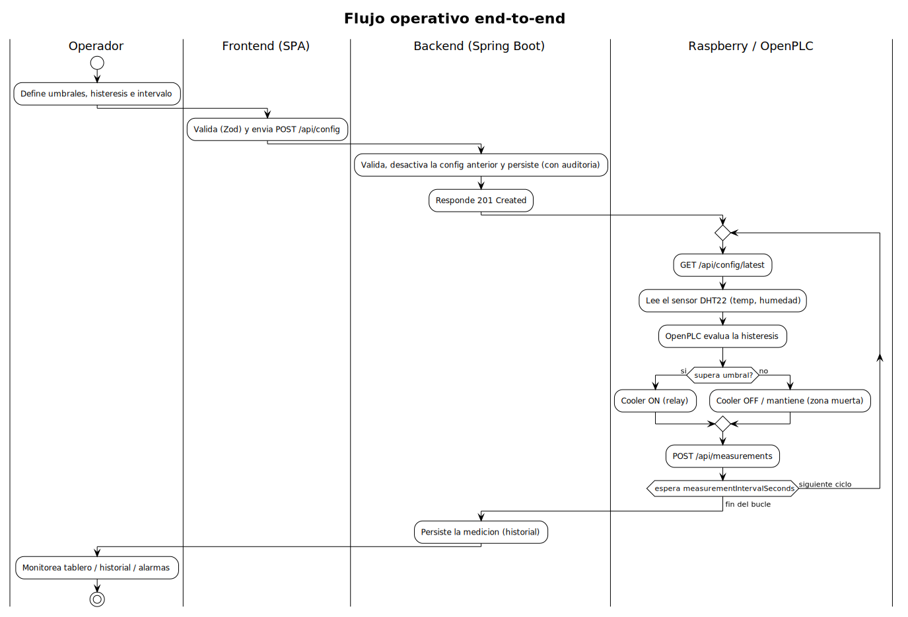](docs/uml/activity_workflow.puml)

## Qué hace el sistema (diagrama de secuencia)

Este diagrama muestra el ciclo completo: el usuario define los umbrales (y el intervalo de
medición) desde la web, la Raspberry los aplica y, cada cierto intervalo configurable, mide,
decide si prende el cooler y publica la medición; todo queda persistido para auditoría e
historial.

[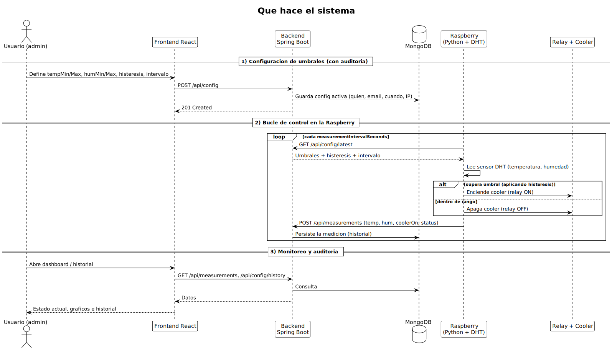](docs/uml/sequence.puml)

## Rol de OpenPLC

OpenPLC se utiliza como controlador lógico del sistema.

No se conecta directamente a MongoDB. La integración se realiza mediante un gateway en Python que actúa como puente entre:

```text
Sensor DHT / Spring Boot API / OpenPLC / Relay
```

OpenPLC recibe valores como temperatura actual, humedad actual y umbrales configurados. A partir de esos datos, ejecuta la lógica de control y determina si el cooler debe estar encendido o apagado.

## Integración con Modbus TCP

La comunicación entre Python y OpenPLC se realiza mediante Modbus TCP.

Mapa de registros sugerido:

| Registro | Variable        | Descripción                            |
| -------- | --------------- | -------------------------------------- |
| HR0      | TEMP_ACTUAL_X10 | Temperatura actual multiplicada por 10 |
| HR1      | HUM_ACTUAL_X10  | Humedad actual multiplicada por 10     |
| HR2      | TEMP_MIN_X10    | Umbral mínimo de temperatura           |
| HR3      | TEMP_MAX_X10    | Umbral máximo de temperatura           |
| HR4      | HUM_MIN_X10     | Umbral mínimo de humedad               |
| HR5      | HUM_MAX_X10     | Umbral máximo de humedad               |
| HR6      | TEMP_HYST_X10   | Histéresis de temperatura              |
| HR7      | HUM_HYST_X10    | Histéresis de humedad                  |

| Coil | Variable     | Descripción                        |
| ---- | ------------ | ---------------------------------- |
| C0   | COOLER_ON    | Estado calculado del cooler        |
| C1   | SENSOR_ERROR | Indica error de lectura del sensor |

Se utilizan valores multiplicados por 10 para trabajar con enteros en Modbus.

Ejemplo:

```text
25.3 °C → 253
80.9 %  → 809
```

## Lógica de control

La lógica de control utiliza histéresis para evitar que el relay active y desactive el cooler
constantemente cerca del umbral. La **histéresis *es* la zona muerta (deadband)**: en vez de un
único punto de conmutación, hay dos umbrales separados —uno para encender y otro, más bajo, para
apagar— y **entre ambos no se cambia de estado** (se mantiene el anterior). Esa franja intermedia es
la zona muerta, y su ancho es `hysteresisTemperature` (y `hysteresisHumidity` para la humedad).

[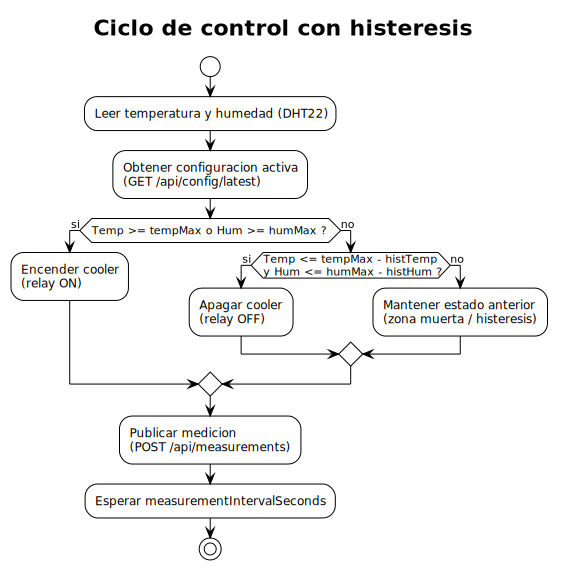](docs/uml/activity_control.puml)

Regla general:

```text
Si temperatura >= temperatureMax → encender cooler.
Si humedad >= humidityMax → encender cooler.
Si temperatura <= temperatureMax - hysteresisTemperature
y humedad <= humidityMax - hysteresisHumidity → apagar cooler.
```

Vista de la banda (para la temperatura; la humedad es análoga):

```text
   COOLER OFF          ZONA MUERTA (deadband)          COOLER ON
                       ancho = hysteresisTemperature
 ─────────────────●═══════════════════════════════●───────────────►  temperatura
                  │                                │
        tempMax - hysteresisTemperature         tempMax
        (apaga al bajar)                        (enciende al subir)
```

Dentro de la zona muerta el actuador **conserva** el estado: si venía encendido sigue encendido
hasta cruzar el límite inferior, y si venía apagado sigue apagado hasta cruzar `tempMax`. Eso es lo
que evita el *chattering* (encendido/apagado rápido del relay) cuando la medición oscila alrededor
del umbral.

La misma respuesta como **diagrama de tiempos (UML)**: el cooler enciende al llegar a `tempMax`,
se mantiene durante toda la banda muerta y recién apaga al bajar de `tempMax - hist`:

[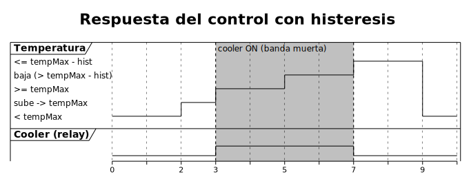](docs/uml/timing.puml)

> **Histéresis de un solo lado (enfriamiento).** La zona muerta se aplica sobre el **máximo**
> (`tempMax`/`humMax`), porque el único actuador es el cooler. Los mínimos (`temperatureMin`/
> `humidityMin`) **no** accionan un actuador con su propia histéresis: sólo se usan para clasificar
> el `status` de la medición (fuera de rango / warning).

## Máquina de estados

### Ciclo de control (Raspberry / Gateway)

Estado global del bucle que corre en la Raspberry.

[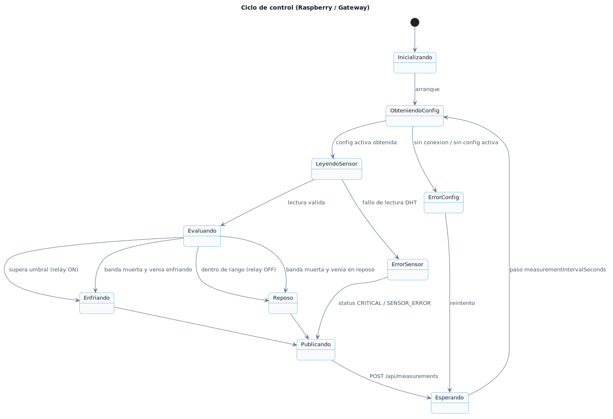](docs/uml/state_control_cycle.puml)

### Sensor DHT

[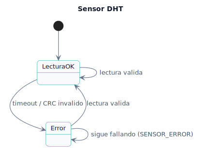](docs/uml/state_sensor.puml)

### Relay / Cooler

[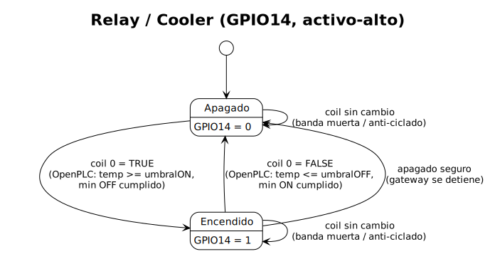](docs/uml/state_relay.puml)

### OpenPLC

[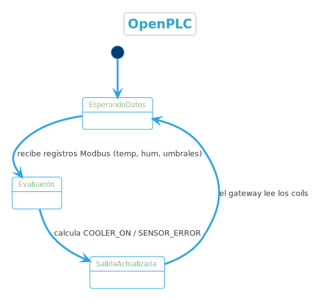](docs/uml/state_openplc.puml)

## Modelo de configuración

Se utiliza historial versionado de configuración.

Cada vez que se envía un POST a `/api/config`, se crea un nuevo documento de configuración y se marca como activo. Las configuraciones anteriores quedan desactivadas, pero no se eliminan.

Esto permite auditar:

* quién cambió los umbrales;
* cuándo los cambió;
* desde qué cliente;
* cuáles eran los valores anteriores.

Ejemplo de respuesta de la API (`GET /api/config/latest`):

```json
{
  "id": "665f1c...",
  "temperatureMin": 22.0,
  "temperatureMax": 28.0,
  "humidityMin": 40.0,
  "humidityMax": 90.0,
  "hysteresisTemperature": 1.0,
  "hysteresisHumidity": 2.0,
  "measurementIntervalSeconds": 30,
  "createdByName": "Gabriel Andino",
  "createdByEmail": "gabriel@example.com",
  "active": true,
  "createdAt": "2026-06-03T12:00:00Z"
}
```

> **Datos sensibles**: `clientIp`, `userAgent` y `deviceFingerprint` se usan solo para el
> control anti-abuso y se guardan **únicamente en la base de datos**. No se exponen en la API
> ni se escriben en los logs (los logs de rate limiting registran solo el "bucket", nunca la
> IP/email/fingerprint).

### Intervalo de medición (configurable)

El campo `measurementIntervalSeconds` define **cada cuánto** la Raspberry lee el sensor y
publica una medición. Es parte de la configuración versionada, así que se setea desde el
frontend junto con los umbrales y queda auditado (quién lo cambió y cuándo).

* **Valor por defecto:** 30 segundos.
* **Rango permitido:** 5 a 1800 segundos (media hora), validado en el backend.
* La Raspberry obtiene este valor en `GET /api/config/latest` y lo usa como cadencia de su
  bucle. Al cambiarlo desde la web, la próxima vez que la Raspberry relea la config, ajusta
  el intervalo sin necesidad de redeploy.

> Por qué configurable: un intervalo más corto da un historial más fino pero genera más
> escritura/tráfico; uno más largo es más liviano. 30 s es un buen punto de equilibrio para
> la demo. El mínimo de 5 s evita saturar el backend (y es coherente con el rate limiting).

## Modelo de medición

Cada medición representa una lectura enviada por la Raspberry.

El campo `status` es un enum (`SystemStatus`) con los valores:

* `NORMAL` — temperatura y humedad dentro de rango.
* `WARNING_TEMP` — temperatura fuera de umbral.
* `WARNING_HUMIDITY` — humedad fuera de umbral.
* `CRITICAL` — fuera de umbral más allá de la histéresis.

Ejemplo:

```json
{
  "id": "665f1d...",
  "temperature": 29.1,
  "humidity": 78.2,
  "coolerOn": true,
  "relayOn": true,
  "status": "WARNING_TEMP",
  "createdAt": "2026-06-03T12:05:00Z"
}
```

> **Down-sampling para gráficos**: `GET /api/measurements` acepta `maxPoints`. Si el rango tiene
> más lecturas que ese tope, el backend devuelve una serie **submuestreada repartida en todo el
> rango** (en vez de la página más reciente), así rangos amplios (mes/año) muestran su período
> completo. Sin `maxPoints` se devuelve la página estándar. El panel de "Calidad de control" del
> frontend, en cambio, pide los puntos **sin** `maxPoints` para contar las transiciones reales.

## Eventos y alarmas (derivados)

El sistema no persiste una colección de "eventos": los **deriva del histórico de mediciones** en
el servidor y los **pagina**, así el cliente recibe solo una página por request (no todo el
histórico). Un evento es una **transición**:

* cambio de estado: entrada a `WARNING_TEMP` / `WARNING_HUMIDITY` / `CRITICAL`, o **retorno a
  normal**;
* acción del cooler: **encendido** / **apagado**;
* **sensor offline** (`SENSOR_OFFLINE`): alarma sintética que aparece cuando la **última medición
  es más vieja que el umbral de inactividad** (`app.sensor.offline-after-seconds`, 1 h por defecto).
  Solo se agrega en la vista viva (sin `to` explícito), como el evento más nuevo; su id
  (`offline-<id de la última medición>`) ata el ACK a esa caída puntual. Así, aunque nadie tenga el
  panel abierto, la próxima consulta de eventos/badge refleja que la Raspberry dejó de publicar.

Cada evento tiene un **id estable** (`<id de la medición que lo disparó>-s|-c`), una severidad y
un flag `ackable` (solo las alarmas se reconocen). El **reconocimiento (ACK)** sí se persiste en
la colección `event_acks` (id = id del evento), por lo que es **compartido entre clientes**,
sobrevive reinicios y el conteo de "sin reconocer" es **global** sobre toda la ventana, no solo la
página visible.

| Endpoint | Método | Descripción |
| --- | --- | --- |
| `/api/events` | `GET` | Página de eventos (más nuevo primero), con `acknowledged` por evento. Params: `from`, `to`, `page`, `size`. |
| `/api/events/unacknowledged-count` | `GET` | Conteo **global** de alarmas sin reconocer en la ventana (para el badge). |
| `/api/events/{id}/ack` | `POST` | Reconoce una alarma (idempotente). `204`. |
| `/api/events/ack-all` | `POST` | Reconoce todas las alarmas sin ACK de la ventana. `204`. |

> **Estado de actividad del sensor.** Como el backend es pasivo (solo guarda lo que llega), la
> "vitalidad" de la Raspberry se infiere de la antigüedad de la última medición. `GET
> /api/measurements/status` lo expone explícitamente: `{ online, lastMeasurementAt, ageSeconds,
> offlineAfterSeconds }` — `online=false` cuando la última lectura supera `app.sensor.offline-after-seconds`
> (1 h por defecto). Es la misma condición que dispara la alarma `SENSOR_OFFLINE`.

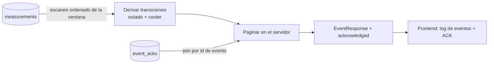

> Derivar al vuelo mantiene el modelo simple (la verdad es la serie de mediciones); como la
> derivación necesita las lecturas en orden, se escanea la ventana pedida (la ventana acota el
> trabajo). Un paso futuro de escala sería persistir los eventos a medida que ocurren y paginarlos
> directamente desde la base.

## Modelo de datos (UML)

Tres colecciones persistidas en MongoDB (`@Document`) y los DTO/enum derivados. `EventResponse` no
se persiste: se **deriva** de la serie de `Measurement` y se enriquece con el ACK de `EventAck`.

Diagrama de clases UML: cada atributo en notación `nombre: Tipo`. El **estereotipo** de cada clase
indica si se persiste — `«document»` son las colecciones de MongoDB (el modelo de datos), `«DTO»` es
una proyección que se calcula en cada request y **no** se persiste, y `«enumeration»` son los
value-types embebidos. Las flechas punteadas (`..>`) son dependencias lógicas (Mongo no tiene FK).

[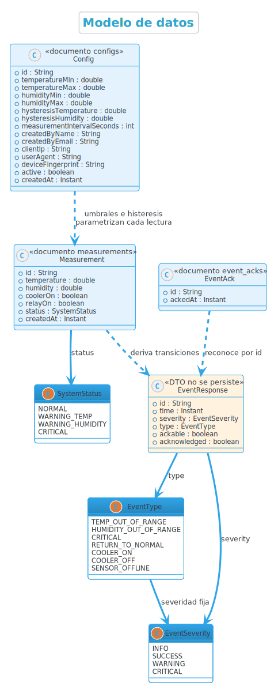](docs/uml/class_model.puml)

> **Cómo leerlo** — el estereotipo en la cabecera de cada clase dice qué se persiste:
> `«document» <colección>` (en `Config`, `Measurement`, `EventAck`) son las tres **colecciones de
> MongoDB** — ese es el modelo de datos. `«DTO» no se persiste` (en `EventResponse`) es una
> proyección que el backend **arma en cada request** a partir de las mediciones y los ACK; nunca se
> guarda. `«enumeration»` son value-types embebidos dentro de un documento/DTO, no colecciones.
> Los documentos van en azul y el DTO en ámbar para reforzar la distinción.

> Sobre los `id`: son `String`, no `UUID`. En `Config` y `Measurement` es el `ObjectId` que genera
> MongoDB (hex de 24 caracteres); en `EventAck` el `id` **es** el id estable del evento
> (`<measurementId>-s` para el cambio de estado, `-c` para el cooler), por eso reconocer una alarma
> es un simple `upsert` por esa clave.
>
> Colecciones: `configs`, `measurements`, `event_acks`. `Measurement.createdAt` tiene índice TTL
> (retención configurable) que además sirve para los filtros/orden por fecha; `Config.active` y
> `Config.createdByEmail` están indexados para la config activa y los filtros de auditoría.
>
> La dependencia `Config ..> Measurement` es **lógica, no física** (Mongo es no relacional, no hay
> FK ni se referencia el `id` de la config en la medición): la `Config` **activa** define los
> umbrales y la histéresis con los que el gateway evalúa cada lectura, y de ahí salen `coolerOn`,
> `relayOn` y `status`. Es una relación de *parametrización* (la config vigente al momento de medir),
> no de pertenencia.

### Diagrama de objetos (UML)

Un **snapshot de instancias** que ejemplifica el modelo: una `Config` activa, la última `Measurement`
y el `EventAck` que reconoce el evento derivado de esa medición.

[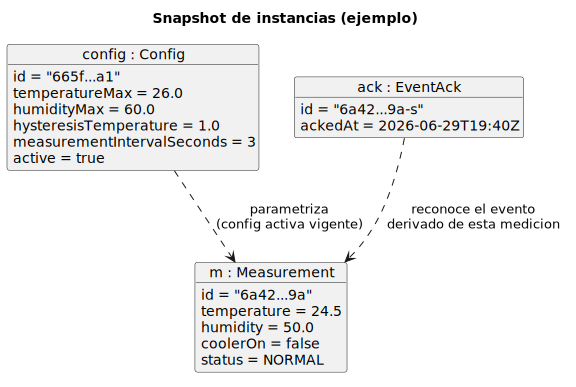](docs/uml/objects.puml)

## Arquitectura por capas (UML)

Arquitectura por capas con **una sola dirección de dependencias** (web → service → repository →
domain). Los controllers no tocan la base; la lógica vive en los services; el acceso a datos está
detrás de los repositorios de Spring Data.

[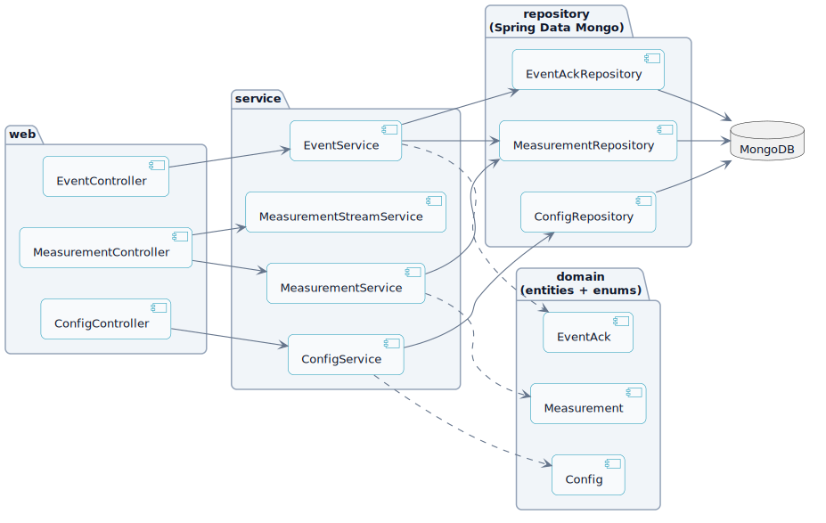](docs/uml/components.puml)

## Diagrama de paquetes (UML)

Organización del código en paquetes y las **dependencias permitidas** (una sola dirección). Formaliza
la misma regla de capas que el diagrama de componentes, a nivel de estructura de código.

[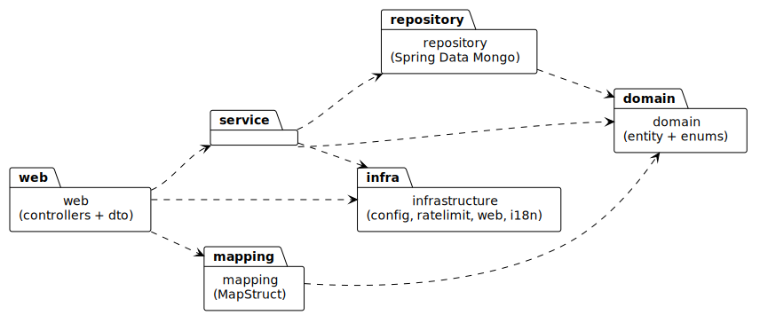](docs/uml/packages.puml)

## Diagrama de despliegue (UML)

Topología física de la solución desplegada: los **nodos** (`«device»` / `«executionEnvironment»`)
alojan **artefactos** (`«artifact»`), y las aristas son **rutas de comunicación** etiquetadas con su
protocolo. Refleja el despliegue real documentado en [`docs/DEPLOYMENT.md`](docs/DEPLOYMENT.md)
(Cloudflare Pages + Railway + MongoDB Atlas + la Raspberry con OpenPLC).

[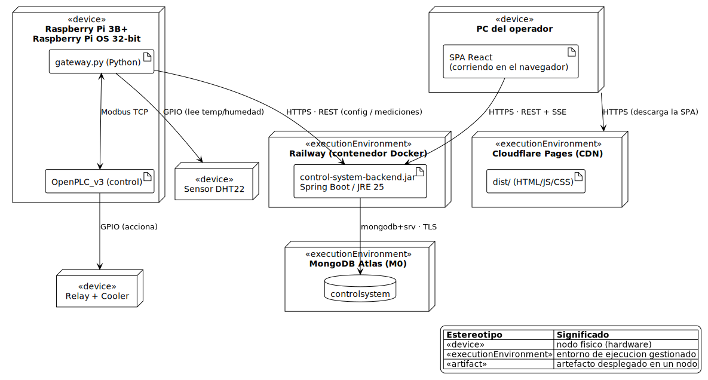](docs/uml/deployment.puml)

> La **ley de control vive en OpenPLC** (el controlador): el `gateway.py` es un puente de I/O y de
> red (lee el DHT22 —que necesita timing que el PLC no hace—, intercambia setpoints y salidas con
> OpenPLC por Modbus, y sincroniza con el backend). El backend y la base son gestionados y no
> requieren infraestructura propia encendida.

## Decisiones de arquitectura (ADR)

Las decisiones de arquitectura significativas están registradas como **ADR** (Architecture Decision
Records) en [`docs/adr/`](docs/adr) — la práctica actual para documentar el *por qué* de las
decisiones de forma liviana y versionada junto al código:

| ADR | Decisión |
| --- | --- |
| [0001](docs/adr/0001-mongodb-document-store.md) | MongoDB como almacén de documentos |
| [0002](docs/adr/0002-derived-events.md) | Eventos/alarmas derivados (no una colección propia) |
| [0003](docs/adr/0003-control-law-in-openplc.md) | La ley de control vive en OpenPLC |
| [0004](docs/adr/0004-managed-deployment.md) | Despliegue gestionado (Atlas + Railway + Cloudflare Pages) |
| [0005](docs/adr/0005-sensor-offline-by-age.md) | Sensor offline inferido por antigüedad del dato |

## Seguridad y anti-abuso

El backend incluye validaciones y límites básicos para evitar abuso de los endpoints públicos.

Protecciones implementadas:

* Rate limiting global por IP.
* Rate limiting específico para `POST /api/config`.
* Rate limiting específico para `POST /api/measurements`.
* Blacklist temporal por IP ante exceso de requests.
* Límite máximo de tamaño de request body.
* Validación estricta de rangos de temperatura y humedad (incluye que la **mínima sea menor
  que la máxima**, no solo el rango absoluto).
* Validación del rango de fechas en los filtros de historial: **"desde" no puede ser posterior
  a "hasta"** y **no se admiten fechas futuras**.
* CORS restringido a los orígenes configurados.

El objetivo no es implementar autenticación completa, sino proteger una API pública simple contra spam o uso abusivo durante la demo del sistema.

## Tiempo real (SSE)

`GET /api/measurements/stream` es un stream **Server-Sent Events**: el backend empuja un evento
`measurement` por cada lectura nueva, así el frontend se actualiza en vivo sin polling. Una
conexión SSE inactiva no ocupa un thread (servlet async); igual está **acotada** para que muchas
pestañas/kioscos abiertos no tumben el servidor:

| Variable de entorno | Default | Qué hace |
| --- | --- | --- |
| `APP_STREAM_ENABLED` | `true` | apaga el stream por completo (el front cae a polling) |
| `APP_STREAM_MAX_SUBSCRIBERS` | `20` | tope **total** de conexiones simultáneas |
| `APP_STREAM_MAX_SUBSCRIBERS_PER_IP` | `3` | tope **por IP** (un cliente con muchas pestañas no acapara) |
| `APP_STREAM_HEARTBEAT_INTERVAL_MS` | `20000` | keep-alive para detectar conexiones caídas |
| `APP_STREAM_TIMEOUT_MS` | `0` | timeout por conexión (`0` = sin límite; ej. `1800000` recicla las viejas) |

Las conexiones que superan un límite se cierran al instante (no se mantienen abiertas), y el
stream también pasa por el rate limiting global, así una tormenta de reconexiones se corta sola.
Los defaults viven en `application.yml` y se pueden sobreescribir por env var (ver
`docker-compose.yml`).

## Ejecutar con Docker

Todo el stack local se puede levantar con:

```bash
docker compose up --build
```

Servicios:

```text
API: http://localhost:8080
Swagger UI: http://localhost:8080/swagger-ui.html
Mongo Express: http://localhost:8081
```

## Despliegue (producción)

Para poner el sistema en internet —de modo que **la Raspberry Pi y el panel consulten la API por una
URL pública HTTPS**— hay una guía dedicada, barata y paso a paso:
**[`docs/DEPLOYMENT.md`](docs/DEPLOYMENT.md)**.

Topología recomendada (demo de uno o dos meses, ~US$5/mes en total):

| Pieza | Servicio | Costo |
| --- | --- | --- |
| MongoDB | Atlas M0 | Gratis |
| Backend (este repo) | Railway (build desde el `Dockerfile`) | ~US$5/mes |
| Frontend | Cloudflare Pages | Gratis |
| Gateway | Raspberry Pi (apunta a la URL del backend) | — |

El repo ya viene listo para Railway: el backend escucha en el `$PORT` que inyecta la plataforma,
respeta `X-Forwarded-*` detrás del proxy, y hay un [`railway.json`](railway.json) con el build por
Docker y el healthcheck a `/actuator/health/readiness`. La guía detalla **todas** las variables de
entorno de cada componente (backend, frontend y Raspberry), el CORS, el smoke test y los problemas
frecuentes.

## Variables de entorno

Todo es configurable por variable de entorno; los valores por defecto sirven para correr el
proyecto sin configuración previa. Las más usadas:

| Variable | Default | Para qué sirve |
| --- | --- | --- |
| `MONGODB_URI` | `mongodb://localhost:27017/controlsystem` | Conexión a MongoDB (Atlas en producción). |
| `CORS_ORIGINS` | `http://localhost:5173` | Orígenes permitidos para el frontend (coma-separados, sin barra final). |
| `PORT` | `8080` | Puerto de escucha. Lo inyecta el host (Railway/Render); **no setear a mano** ahí. |
| `LOG_LEVEL` | `INFO` | Nivel de log de la app. Poné `DEBUG` para trazas verbosas en local. |
| `APP_RETENTION_MEASUREMENT_DAYS` | `90` | Días que se conservan las mediciones (índice TTL). `0` desactiva el borrado. |
| `APP_SENSOR_OFFLINE_AFTER_SECONDS` | `3600` | Segundos sin mediciones nuevas tras los cuales la Raspberry se considera offline (estado `/status` + alarma `SENSOR_OFFLINE`). |
| `APP_CONFIG_API_KEY` | *(vacío)* | Si se setea, `POST /api/config` exige el header `X-Api-Key`. Vacío = sin auth. |
| `MAX_BODY_BYTES` | `8192` | Tamaño máximo del body; por encima responde `413`. |
| `APP_STREAM_ENABLED` | `true` | Habilita el stream SSE de mediciones en tiempo real. |
| `APP_STREAM_HEARTBEAT_INTERVAL_MS` | `20000` | Intervalo del heartbeat que mantiene viva la conexión SSE. |
| `APP_STREAM_MAX_SUBSCRIBERS` | `20` | Tope global de conexiones SSE concurrentes. |
| `APP_STREAM_MAX_SUBSCRIBERS_PER_IP` | `3` | Tope de conexiones SSE por IP (evita que un kiosco acapare cupos). |
| `APP_STREAM_TIMEOUT_MS` | `0` | Timeout por conexión SSE (`0` = sin timeout). |
| `RL_BLACKLIST_MINUTES` | `15` | Minutos que una IP queda bloqueada al superar el umbral de rate limiting. |

El rate limiting por endpoint (`app.rate-limit.*`) se ajusta en
[`application.yml`](src/main/resources/application.yml); los valores por defecto ya están
pensados para el uso real (Raspberry publicando ~1 medición cada 10 s).

## Datos de prueba

El proyecto incluye un seed inicial para MongoDB con:

* configuraciones históricas (con una activa) y nombres acentuados para probar los filtros;
* ~1300 mediciones con resolución mixta: **densas en las últimas 24 h** (una cada 2 min) y más
  espaciadas hasta 14 días atrás (una cada 30 min);
* la **última medición casi "en vivo"** (timestamp ≈ ahora), para que el badge de salud
  muestre *En línea* apenas reseedeás;
* ciclos de cooler con **histéresis real** (estado arrastrado) y los cuatro estados
  (`NORMAL`, `WARNING_TEMP`, `WARNING_HUMIDITY`, `CRITICAL`).

Así se pueden probar todas las vistas: kiosco y rangos cortos del dashboard (1 h/12 h/24 h),
análisis del rango (promedios, % fuera de rango, duty cycle), timeline del cooler, alertas y
los filtros del historial.

Los timestamps son **relativos al momento del seed**, así que para tener datos frescos hay que
regenerar (el seed solo corre con la base vacía):

```bash
docker compose down -v   # borra el volumen y reseedea con datos hasta "ahora"
docker compose up --build
```

Para **reseedear sin borrar el volumen** o **simular la Raspberry en vivo** (badge "en línea",
cooler reaccionando, alerta roja a demanda) cuando el dispositivo todavía no está conectado, ver
[`scripts/README.md`](scripts/README.md).

## Reconstruir / limpiar (Docker)

Si cambiás código del backend, hay que **reconstruir la imagen** (si solo hacés
`docker compose up`, sigue corriendo la imagen vieja):

```bash
docker compose up -d --build           # reconstruye lo que cambió y levanta
```

Reconstrucción forzada ignorando la caché de build:

```bash
docker compose build --no-cache backend
docker compose up -d
```

Resetear los datos de Mongo (borra el volumen y vuelve a ejecutar el seed):

```bash
docker compose down -v                  # ⚠️ borra el volumen mongodb_data
docker compose up -d --build
```

Liberar caché del builder de Docker (global, no solo de este proyecto):

```bash
docker builder prune -f
```

> Recordá: `down -v` borra la data (configuraciones y mediciones) y re-seedea; sin `-v` se
> conserva. El frontend con `npm run dev` toma los cambios solo; el backend en Docker no:
> hay que reconstruir.

## Documentación de la API

La referencia completa de endpoints (rutas, parámetros, filtros, esquemas de request/response
y códigos de estado) está documentada con **OpenAPI/Swagger**, generada desde el código:

```text
Swagger UI:        http://localhost:8080/swagger-ui.html
Especificación:    http://localhost:8080/api-docs
```

Ejemplos rápidos de requests y responses: `docs/examples.http`.

## Estado del proyecto

Este backend forma parte de un sistema mayor compuesto por:

```text
Frontend React
Backend Spring Boot
MongoDB
Python Gateway
OpenPLC Runtime
Raspberry Pi 3B+
Sensor DHT
Relay
Cooler
```

La integración con Raspberry/OpenPLC se realiza desde el Python Gateway, mientras que este backend se encarga de persistir configuración, historial y exponer la API REST para el frontend.

El **frontend** (panel web React que consume esta API) vive en su propio repositorio:
[plc-control-frontend](https://github.com/andinogabriel/plc-control-frontend).
