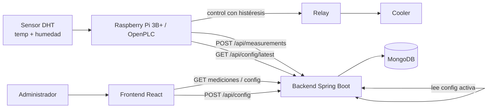
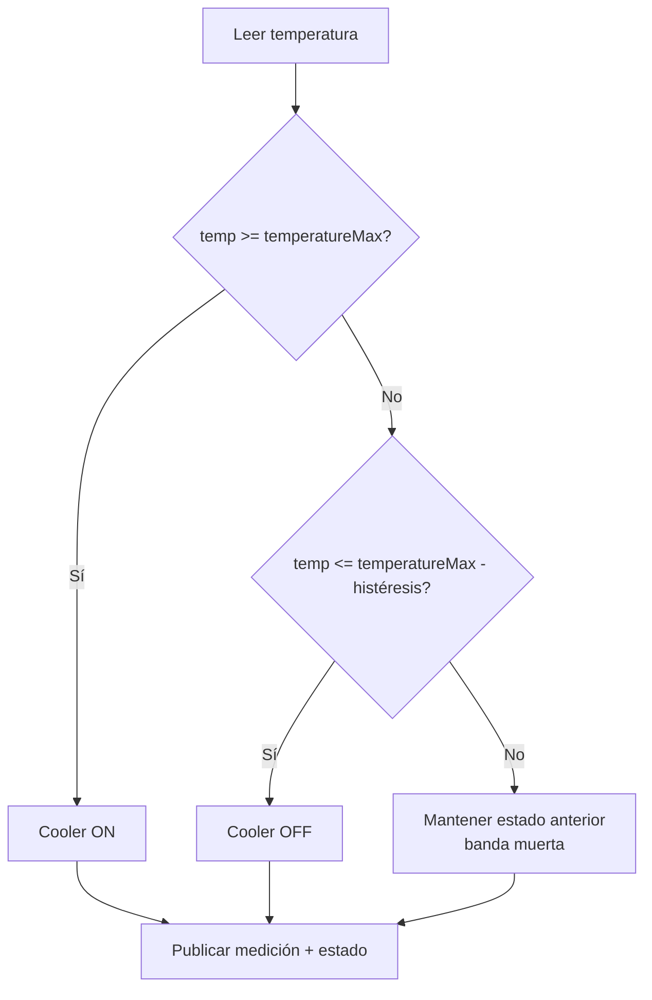

# Backend — Sistema de Control PLC

Backend REST para un sistema de control de temperatura/humedad (Raspberry Pi 3B+ + sensor DHT + OpenPLC + relay + cooler).
Java 25 · Spring Boot 3.5 · Spring Data MongoDB · arquitectura limpia por capas.

## Qué es y para qué sirve

Es un sistema de **control de clima** (temperatura y humedad) para una sala/equipo, pensado
como proyecto de **Teoría de Control** (UNCAUS, 2026). El objetivo es mantener la temperatura
y la humedad dentro de umbrales configurables, encendiendo o apagando un **cooler** (vía un
relay controlado por la Raspberry / OpenPLC) y registrando todo para auditarlo desde una web.

- El usuario define **umbrales** (mín/máx de temperatura y humedad) y la **histéresis** (banda
  muerta que evita que el cooler prenda/apague constantemente cerca del límite).
- La Raspberry **lee el sensor DHT**, decide el estado del cooler con esos umbrales y
  **publica cada medición** en este backend.
- El backend **persiste** configuraciones (versionadas, con auditoría de quién/cuándo) y
  mediciones, y las expone por una **API REST** que consume el frontend.

### Cómo se comporta el sistema



### Lógica de control (histéresis)



## Stack

- Java 25 (toolchain Gradle)
- Spring Boot 3.5 (Web, Validation, Data MongoDB)
- MongoDB 7
- Lombok + MapStruct (mapeos entidad <-> DTO)
- Apache Commons Lang3 (utilidades)
- springdoc-openapi (Swagger UI)
- Rate limiting en memoria (sin dependencias externas)

> Nota sobre versiones: al momento de escribir, la última línea estable de Spring Boot
> que soporta Java 25 como toolchain es la 3.5.x. Si en tu entorno hay una versión más
> nueva (p. ej. 4.x estable), basta con subir el número en `build.gradle.kts`.

## Estructura

```
src/main/java/com/control/system/
├── ControlSystemApplication.java
├── domain/
│   ├── entity/        # Config, Measurement (documentos Mongo, @Getter/@Setter)
│   └── enums/         # SystemStatus
├── mapping/           # ConfigMapper, MeasurementMapper (MapStruct)
│                      #   (los *MapperImpl los genera MapStruct en compilación)
├── repository/
│   ├── *Repository            # Spring Data + fragmento custom
│   ├── *RepositoryImpl        # búsqueda dinámica con MongoTemplate + Criteria
│   ├── filter/                # ConfigSearchFilter, MeasurementSearchFilter
│   └── support/               # MongoQuerySupport (helpers reutilizables)
├── service/           # ConfigService, MeasurementService (lógica de negocio)
├── web/
│   ├── controller/    # ConfigController, MeasurementController
│   ├── dto/
│   │   ├── request/   # ConfigRequest, MeasurementRequest (validación)
│   │   └── response/  # *Response, PageResponse
│   └── exception/     # GlobalExceptionHandler, ErrorResponse
└── infrastructure/
    ├── config/        # CorsConfig, OpenApiConfig
    ├── ratelimit/     # RateLimiter (interfaz) + impl sliding-window,
    │                  #   RateLimitService (política), RateLimitProperties
    ├── i18n/          # MessageResolver (wrapper de MessageSource)
    ├── text/          # TextNormalizer (quita acentos + lower-case)
    └── web/           # ClientIpResolver, RateLimitFilter, RequestSizeFilter, HttpErrorWriter

resources/
└── messages.properties   # todos los mensajes al cliente, en español (UTF-8)
```

### Mensajes al cliente (i18n)

Todos los textos que ve el cliente —errores de validación, reglas de negocio, 404, 429,
413, 500— están centralizados en `src/main/resources/messages.properties` **en español**.

- Las anotaciones de Bean Validation usan claves `{config.createdByEmail.invalid}`;
  `ValidationConfig` cablea el validador al `MessageSource` para que resuelvan desde ese
  bundle (en vez del `ValidationMessages.properties` por defecto de JSR-380).
- Los services y el `GlobalExceptionHandler` resuelven vía `MessageResolver`.
- `RateLimitException` lleva un **código** de mensaje, no el texto literal, así el idioma
  queda en un solo lugar.

Para agregar inglés en el futuro: crear `messages_en.properties` y resolver el locale por
header `Accept-Language`. La estructura ya lo soporta sin tocar código.

### Diseño SOLID de la capa anti-abuso

- `RateLimiter` es una **interfaz** (DIP): la implementación en memoria
  (`InMemorySlidingWindowRateLimiter`) se puede reemplazar por una de Redis/bucket4j sin
  tocar a los llamadores.
- `RateLimitService` define la **política** (qué bucket aplica a cada caso de uso) y no
  sabe nada de HTTP.
- `RateLimitFilter` aplica el techo global por IP a *todos* los endpoints; los límites por
  caso de uso viven en los services.
- Las búsquedas con filtros opcionales usan **fragmentos de repository custom** con
  `MongoTemplate` + `Criteria`, evitando la explosión combinatoria de métodos derivados.

## Modelo de configuración: decisión de diseño

Se eligió **historial versionado** en lugar de un único documento mutable:

- Cada `POST /api/config` inserta un documento nuevo y lo marca `active = true`,
  desactivando (`active = false`) todos los anteriores en una sola operación.
- `GET /api/config/latest` devuelve el documento con `active = true` más reciente.
- `GET /api/config/history` devuelve todo el historial paginado, con la metadata de
  auditoría (IP, user-agent, email, fingerprint, timestamp).

Ventaja para una defensa universitaria: la auditoría es trivial de mostrar (cada cambio
queda registrado con quién/cuándo/desde dónde) y no se pierde información histórica.

## Ejecutar con Docker (recomendado para probar)

Todo el stack (Mongo + backend + mongo-express) en un comando:

```bash
docker compose up --build
```

- API: `http://localhost:8080` · Swagger UI: `http://localhost:8080/swagger-ui.html`
- mongo-express (UI de Mongo): `http://localhost:8081`
- La primera vez, Mongo carga **datos de prueba** automáticamente (ver más abajo).

El `Dockerfile` es multi-stage: compila con `gradle:9.1.0-jdk25` (Gradle 9.1 corre nativo
sobre JDK 25) y corre sobre `eclipse-temurin:25-jre` como usuario no-root. No necesitás
tener Gradle ni JDK instalados para levantarlo así.

### Datos de prueba (seed)

`docker/mongo-init/seed.js` se ejecuta automáticamente cuando el volumen de Mongo está
vacío (primer arranque). Carga:

- **12 configuraciones** con nombres acentuados (`Andinó`, `Núñez`, `Pérez`...) repartidas
  en el tiempo, la última marcada como activa — sirve para probar la tabla de historial,
  los filtros (contains sin acentos) y el gráfico de evolución de umbrales.
- **~336 mediciones** (7 días, una cada 30 min) con temperatura/humedad sinusoidal, picos
  ocasionales y `status`/`coolerOn` derivados — pueblan el dashboard, la tabla y los gráficos.

Reseed (borra el volumen y vuelve a cargar):

```bash
docker compose down -v && docker compose up --build
```

Cargar el seed contra un Mongo ya corriendo (sin Docker):

```bash
mongosh "mongodb://localhost:27017/controlsystem" docker/mongo-init/seed.js
```

## Ejecutar sin Docker (desarrollo)

### 1. Levantar solo MongoDB

```bash
docker compose up -d mongodb
```

### 2. Generar el wrapper de Gradle (solo la primera vez)

```bash
gradle wrapper --gradle-version 9.1.0
```

### 3. Ejecutar la app

```bash
./gradlew bootRun        # Linux/Mac
.\gradlew.bat bootRun    # Windows
```

La API queda en `http://localhost:8080`.

## Variables de entorno

| Variable | Default | Descripción |
| --- | --- | --- |
| `MONGODB_URI` | `mongodb://localhost:27017/controlsystem` | Cadena de conexión |
| `CORS_ORIGINS` | `http://localhost:5173` | Orígenes permitidos (coma-separados) |

## Seguridad / anti-abuso

Todos los límites son configurables en `application.yml` (`app.rate-limit.*`, `app.request.*`).
Los valores por defecto están **tuneados pensando en un host pago chico** (p. ej. Render free,
512 MB) con varios compañeros probando a la vez, para evitar el colapso del servidor o una
factura inflada por abuso:

| Protección | Límite por defecto | Por qué ese número |
| --- | --- | --- |
| **Techo global por IP** (todos los endpoints) | 100 req/min | Es la defensa principal contra el costo. Un tab navegando (polling cada 5 s) usa ~12/min, así que 100 deja margen pero corta floods. |
| **POST /api/config por IP** | 10/min | Es el write más caro (auditado, desactiva otros). |
| **POST /api/config por email** | 5/min | Frena spam del mismo usuario aunque rote de IP. |
| **Cooldown por deviceFingerprint** | 5 cada 5 min | Frena reenvíos repetidos del mismo navegador. |
| **POST /api/measurements por IP** | 30/min | La Raspberry manda ~6/min (1 cada 10 s); 30 es holgado. |
| **Blacklist temporal por IP** | a las 300 req/min global → bloqueo 15 min | Castiga al que insiste por encima del techo. |
| **Tamaño máximo de body** | 8 KB (413 si se excede) | `RequestSizeFilter` por `Content-Length` + backstops de Tomcat. |

Otros controles:
- **Validación estricta**: Bean Validation (rangos -10..60 °C, 0..100 %) + validaciones
  cruzadas (`min < max`) en el service.
- **CORS restringido**: solo los orígenes configurados, solo GET/POST/OPTIONS.
- **Logs de rechazos**: cada límite excedido / IP blacklisteada se registra con WARN.
- **429 / 413**: devueltos por los filtros y el `GlobalExceptionHandler`.

> El rate limiting en memoria es deliberadamente simple (defendible y sin infraestructura
> extra). `RateLimiter` es una interfaz, así que para producción multi-instancia se
> reemplaza por Redis + bucket4j sin tocar los services. Como el límite es por instancia,
> en un free tier de 1 sola instancia protege exactamente lo que necesitás.

## Endpoints

### Configuración

| Método | Ruta | Descripción |
| --- | --- | --- |
| POST | `/api/config` | Crea config nueva, la marca activa |
| GET | `/api/config/latest` | Config activa actual |
| GET | `/api/config/history?from=&to=&createdByName=&createdByEmail=&temperatureMin=&temperatureMax=&humidityMin=&humidityMax=&page=&size=&sort=` | Historial paginado con filtros de columna |

> `createdByName` / `createdByEmail` son filtros **contains** insensibles a mayúsculas y a
> acentos (p. ej. `gabriel` matchea `Gabriel Andinó`). Se resuelven contra campos
> normalizados (`*Normalized`) porque la collation de MongoDB no aplica a `$regex`. Los
> filtros numéricos (`temperatureMin`, etc.) son match exacto sobre el valor guardado.

### Mediciones

| Método | Ruta | Descripción |
| --- | --- | --- |
| POST | `/api/measurements` | Registra medición (desde la Raspberry) |
| GET | `/api/measurements/latest` | Última medición (último valor válido) |
| GET | `/api/measurements?from=&to=&status=&temperatureMin=&temperatureMax=&humidityMin=&humidityMax=&coolerOn=&page=&size=&sort=` | Mediciones paginadas con filtros (fecha, estado, rangos de temp/humedad, cooler) |

Ver [`docs/examples.http`](docs/examples.http) para ejemplos de request/response.

## Tests

```bash
./gradlew test
```

Tests unitarios con **JUnit (Jupiter) + Mockito**:
- `ConfigServiceTest`: desactivación de la config previa, persistencia de la nueva como
  activa con metadata de auditoría, validaciones cruzadas, `latest` sin resultados.
- `MeasurementServiceTest`: default de `status` a `NORMAL`, sellado de `createdAt`, `latest`
  sin resultados.
- `InMemorySlidingWindowRateLimiterTest`: límite respetado, 429 al excederse, blacklist al
  superar el umbral, independencia entre claves.

Los services se testean con los mappers MapStruct **reales** (`*MapperImpl` generados), así
el test cubre también el mapeo. Repos, `MongoTemplate` y `RateLimitService` se mockean.

> Nota sobre JUnit 6: el BOM de Spring Boot 3.5 gestiona JUnit 5 (Jupiter). La API que usan
> estos tests es idéntica en JUnit 6; si querés forzar la 6.x, sobreescribí la versión del
> platform en `build.gradle.kts`. Se dejó en Jupiter para no romper el BOM.

## Deploy gratuito / económico

| Componente | Opción recomendada | Notas |
| --- | --- | --- |
| MongoDB | **MongoDB Atlas** (free tier M0, 512 MB) | Gratis, suficiente para el proyecto |
| Backend | **Render** (free web service) o **Railway** | Render duerme tras inactividad; Railway tiene crédito mensual |
| Frontend | **Vercel** o **Netlify** | Build de Vite estático, gratis |

Pasos rápidos:
1. Crear cluster M0 en Atlas, copiar la URI a `MONGODB_URI`.
2. Backend en Render: build `./gradlew bootJar`, start `java -jar build/libs/*.jar`,
   setear `MONGODB_URI` y `CORS_ORIGINS` (= URL de Vercel).
3. Frontend en Vercel: setear `VITE_API_BASE_URL` = URL pública del backend de Render.
