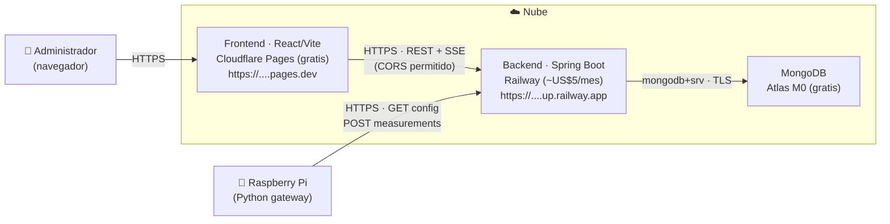

# Despliegue — Backend (Railway) + MongoDB (Atlas) + Frontend (Cloudflare Pages) + Raspberry Pi

Guía para poner el sistema en internet de forma barata, de modo que **la Raspberry Pi y el panel
web consulten la API por una URL pública HTTPS**. Pensada para una demo de uno o dos meses: la base
de datos y el frontend quedan en planes gratuitos y solo el backend tiene un costo bajo (~US$5/mes
en Railway), que se puede cancelar al terminar.

## Contenido

- [Topología](#topología)
- [Resumen de servicios y costos](#resumen-de-servicios-y-costos)
- [Requisitos previos](#requisitos-previos)
- [Paso 1 — MongoDB Atlas (base de datos)](#paso-1--mongodb-atlas-base-de-datos)
- [Paso 2 — Backend en Railway](#paso-2--backend-en-railway)
- [Paso 3 — Frontend en Cloudflare Pages](#paso-3--frontend-en-cloudflare-pages)
- [Paso 4 — Conectar CORS (frontend ↔ backend)](#paso-4--conectar-cors-frontend--backend)
- [Paso 5 — Raspberry Pi (gateway)](#paso-5--raspberry-pi-gateway)
- [Referencia completa de variables de entorno](#referencia-completa-de-variables-de-entorno)
- [Verificación (smoke test)](#verificación-smoke-test)
- [Checklist de seguridad](#checklist-de-seguridad)
- [Problemas frecuentes](#problemas-frecuentes)
- [Costos y baja del servicio](#costos-y-baja-del-servicio)

## Topología



La Raspberry **no es un navegador**, así que no la afecta CORS: solo necesita la URL pública HTTPS
del backend y (si lo activás) la API key. El panel web sí es un navegador, por eso su origen debe
estar en `CORS_ORIGINS`.

## Resumen de servicios y costos

| Pieza | Servicio | Plan | Costo | Notas |
| --- | --- | --- | --- | --- |
| Base de datos | MongoDB Atlas | M0 | **Gratis** (512 MB, no expira) | Gestionada, TLS obligatorio. |
| Backend | Railway | Hobby | **~US$5/mes** | Build desde el `Dockerfile`; sin cold-start. |
| Frontend | Cloudflare Pages | Free | **Gratis** | Build estático `dist/`, CDN + HTTPS. |
| Gateway | Raspberry Pi | — | — | Hardware propio; solo apunta a la URL del backend. |

> Alternativas para el backend: **Render** (free, pero se duerme a los 15 min → la primera request
> de la Pi puede dar timeout) y **Oracle Cloud Always Free** (VM ARM gratis para siempre, pero hay
> que administrar Docker/HTTPS a mano). Para una demo corta, Railway es el mejor equilibrio.

## Requisitos previos

- Repos en GitHub: este backend y el frontend.
- Cuentas (login con GitHub): [MongoDB Atlas](https://www.mongodb.com/cloud/atlas/register),
  [Railway](https://railway.com), [Cloudflare](https://dash.cloudflare.com/sign-up).
- `curl` para las pruebas.

## Paso 1 — MongoDB Atlas (base de datos)

1. Creá un proyecto y un cluster **M0** (Shared, gratis). Elegí una región cercana a la del backend.
2. **Database Access** → creá un usuario (ej. `controlsystem`) con una contraseña fuerte y rol
   *Read and write to any database*. Anotá la contraseña.
3. **Network Access** → *Add IP Address* → **`0.0.0.0/0`** (Allow access from anywhere). Es
   necesario porque la IP de salida de Railway y de la Raspberry es dinámica. La seguridad real la
   da el usuario/clave + TLS, que Atlas fuerza.
4. **Connect → Drivers** → copiá la cadena `mongodb+srv://...` y completala con la base
   `controlsystem`. Queda así (con la contraseña **URL-encodeada** si tiene símbolos):

   ```text
   mongodb+srv://controlsystem:<PASSWORD>@cluster0.xxxxx.mongodb.net/controlsystem?retryWrites=true&w=majority
   ```

   Ese valor es tu `MONGODB_URI`.

> El backend crea sus índices (incluido el TTL de retención) automáticamente al arrancar; no hay que
> preparar colecciones a mano.

## Paso 2 — Backend en Railway

El repo ya está listo para Railway: incluye el [`Dockerfile`](../Dockerfile) y un
[`railway.json`](../railway.json) que define el build por Docker y el healthcheck. El backend ya
escucha en el puerto que inyecta Railway (`$PORT`) y respeta `X-Forwarded-*` detrás del proxy.

1. **New Project → Deploy from GitHub repo** → elegí este backend. Railway detecta el `Dockerfile`.
2. **Variables** → cargá (ver la [referencia completa](#referencia-completa-de-variables-de-entorno)):

   | Variable | Valor | Obligatoria |
   | --- | --- | --- |
   | `MONGODB_URI` | la cadena de Atlas del Paso 1 | **Sí** |
   | `CORS_ORIGINS` | la URL del frontend (se completa en el Paso 4) | **Sí** |
   | `APP_CONFIG_API_KEY` | una clave larga aleatoria | Recomendada |
   | `APP_RETENTION_MEASUREMENT_DAYS` | `30` | Opcional (bajalo en M0) |
   | `LOG_LEVEL` | `INFO` | Opcional |

   > **No** setees `PORT`: lo inyecta Railway. `JAVA_OPTS` ya viene en el Dockerfile
   > (`-XX:MaxRAMPercentage=75`); si la instancia es de 512 MB y ves OOM, subila a 1 GB o agregá
   > `-XX:+UseSerialGC`.

3. **Settings → Networking → Generate Domain** (puerto `8080`). Esa es la URL pública del backend,
   ej. `https://control-system-backend-production.up.railway.app`.
4. Railway usa el healthcheck `/actuator/health/readiness` (definido en `railway.json`), que solo
   pasa cuando MongoDB está conectado. El primer deploy queda *healthy* cuando Atlas responde.

## Paso 3 — Frontend en Cloudflare Pages

1. **Workers & Pages → Create → Pages → Connect to Git** → elegí el repo del frontend.
2. Build:
   - **Framework preset**: Vite (o None).
   - **Build command**: `npm run build`
   - **Build output directory**: `dist`
3. **Environment variables (Production)**:

   | Variable | Valor |
   | --- | --- |
   | `VITE_API_BASE_URL` | la URL del backend de Railway (Paso 2) |
   | `VITE_CONFIG_API_KEY` | la misma `APP_CONFIG_API_KEY` del backend (si la activaste) |

   > Son variables de **build**: Vite las embebe en el bundle. Si las cambiás, hay que re-deployar.
   > Una key embebida en una SPA pública es una barrera mínima, no un secreto real (la seguridad
   > vive en el backend).
4. Deploy. Tu panel queda en `https://<proyecto>.pages.dev`.

## Paso 4 — Conectar CORS (frontend ↔ backend)

Con la URL final del frontend, volvé a **Railway → Variables** y seteá:

```text
CORS_ORIGINS = https://<proyecto>.pages.dev
```

- Sin **barra final** y solo el origen (esquema + host), no una ruta.
- Si usás varios orígenes (ej. dominio propio + `.pages.dev`), separalos por coma:
  `https://app.midominio.com,https://<proyecto>.pages.dev`.
- Railway re-deploya solo al guardar. Hasta que el origen del frontend esté acá, el panel falla por
  CORS (la Raspberry no, porque no es navegador).

## Paso 5 — Raspberry Pi (gateway)

El cliente de ejemplo es [`raspberry_sensor_example.py`](raspberry_sensor_example.py) y ya toma la
URL del backend por variable de entorno. En la Pi:

```bash
export API_BASE="https://control-system-backend-production.up.railway.app"   # sin barra final
# Solo si la Pi publicara config (no hace falta para publicar mediciones):
# export CONFIG_API_KEY="la-misma-que-APP_CONFIG_API_KEY"

pip install requests          # + adafruit-circuitpython-dht RPi.GPIO en hardware real
python3 raspberry_sensor_example.py
```

- Publicar mediciones (`POST /api/measurements`) **no** requiere API key; está protegido por rate
  limiting por IP (30 req/min, sobra para ~1 cada 10–30 s).
- La cadencia real la marca `measurementIntervalSeconds` de la config activa (se cambia desde el
  panel); el `DEFAULT_INTERVAL_SECONDS` solo se usa hasta obtener la primera config.
- Para que corra sola al bootear, registrala como servicio `systemd` con las `Environment=API_BASE=...`.

## Referencia completa de variables de entorno

### Backend (Railway)

| Variable | Default | Obligatoria | Para qué sirve |
| --- | --- | --- | --- |
| `MONGODB_URI` | `mongodb://localhost:27017/controlsystem` | **Sí** (prod) | Cadena de conexión a Atlas (`mongodb+srv://...`). |
| `CORS_ORIGINS` | `http://localhost:5173` | **Sí** (prod) | Orígenes del frontend permitidos (coma-separados, sin barra final). |
| `PORT` | `8080` | No (la inyecta Railway) | Puerto de escucha. **No setear a mano** en Railway. |
| `APP_CONFIG_API_KEY` | *(vacío)* | Recomendada | Si se setea, `POST /api/config` exige header `X-Api-Key`. |
| `APP_RETENTION_MEASUREMENT_DAYS` | `90` | No | Días de retención de mediciones (índice TTL). `0` desactiva. Bajalo en M0. |
| `LOG_LEVEL` | `INFO` | No | Nivel de log de la app (`DEBUG` para trazas). |
| `MAX_BODY_BYTES` | `8192` | No | Tamaño máx. del body; por encima responde `413`. |
| `JAVA_OPTS` | `-XX:MaxRAMPercentage=75.0` | No | Flags de la JVM (memoria/GC). Definido en el Dockerfile. |
| `APP_STREAM_ENABLED` | `true` | No | Habilita el stream SSE de tiempo real. |
| `APP_STREAM_HEARTBEAT_INTERVAL_MS` | `20000` | No | Heartbeat que mantiene viva la conexión SSE. |
| `APP_STREAM_MAX_SUBSCRIBERS` | `20` | No | Tope global de conexiones SSE concurrentes. |
| `APP_STREAM_MAX_SUBSCRIBERS_PER_IP` | `3` | No | Tope de conexiones SSE por IP. |
| `APP_STREAM_TIMEOUT_MS` | `0` | No | Timeout por conexión SSE (`0` = sin timeout). |
| `RL_BLACKLIST_MINUTES` | `15` | No | Minutos de bloqueo de una IP al superar el umbral de rate limiting. |

### Frontend (Cloudflare Pages — variables de **build**)

| Variable | Default | Obligatoria | Para qué sirve |
| --- | --- | --- | --- |
| `VITE_API_BASE_URL` | `http://localhost:8080` | **Sí** (prod) | URL base del backend (Railway). |
| `VITE_CONFIG_API_KEY` | *(vacío)* | Solo si el backend tiene `APP_CONFIG_API_KEY` | Se manda como `X-Api-Key` en `POST /api/config`. |

### Raspberry Pi (gateway)

| Variable | Default | Obligatoria | Para qué sirve |
| --- | --- | --- | --- |
| `API_BASE` | `http://localhost:8080` | **Sí** (prod) | URL pública HTTPS del backend (sin barra final). |
| `CONFIG_API_KEY` | *(vacío)* | No | Solo si la Pi publica config; se envía como `X-Api-Key`. |

## Verificación (smoke test)

Con `BASE` = la URL del backend en Railway:

```bash
# 1) Salud (incluye conexión a Mongo)
curl -s "$BASE/actuator/health" ; echo
# -> {"status":"UP"}

# 2) Config activa (puede dar 404 si todavía no cargaste ninguna desde el panel)
curl -s "$BASE/api/config/latest" ; echo

# 3) Publicar una medición de prueba (como haría la Raspberry)
curl -s -X POST "$BASE/api/measurements" \
  -H "Content-Type: application/json" \
  -d '{"temperature":24.5,"humidity":50,"coolerOn":false,"relayOn":false,"status":"NORMAL"}' ; echo

# 4) Última medición
curl -s "$BASE/api/measurements/latest" ; echo
```

Desde el navegador, abrí el panel (`https://<proyecto>.pages.dev`): si carga datos y no hay errores
de CORS en la consola, los tres servicios están bien conectados.

## Checklist de seguridad

- [ ] Usuario de Atlas con contraseña fuerte; cadena `MONGODB_URI` solo en variables de Railway
      (nunca commiteada).
- [ ] `APP_CONFIG_API_KEY` activada para proteger la escritura de configuración.
- [ ] `CORS_ORIGINS` con los orígenes **exactos** del frontend (no `*`).
- [ ] HTTPS de punta a punta (no usar `--insecure`/`verify=False` en la Raspberry).
- [ ] Atlas `0.0.0.0/0` es un compromiso aceptable para la demo; cerralo a rangos conocidos si el
      sistema queda permanente.

## Problemas frecuentes

| Síntoma | Causa probable | Solución |
| --- | --- | --- |
| El panel no carga datos; consola muestra error de **CORS** | `CORS_ORIGINS` no incluye el origen del frontend | Setear `CORS_ORIGINS` con la URL exacta (sin barra final) y re-deployar. |
| Backend reinicia / healthcheck falla | No conecta a Mongo (URI mal, password sin URL-encode, IP no permitida) | Revisar `MONGODB_URI`, encodear símbolos de la contraseña, `0.0.0.0/0` en Atlas. |
| `Application failed to bind to $PORT` | Se seteó `PORT` a mano | Borrar la variable `PORT`; la inyecta Railway. |
| OOM / la instancia muere bajo carga | Heap chico (512 MB) | Subir a 1 GB o agregar `-XX:+UseSerialGC` a `JAVA_OPTS`. |
| La Raspberry no publica (timeout) | `API_BASE` mal o sin internet | Probar `curl "$API_BASE/actuator/health"` desde la Pi. |
| `401` en `POST /api/config` | El backend tiene `APP_CONFIG_API_KEY` y el cliente no manda `X-Api-Key` | Setear `VITE_CONFIG_API_KEY` (frontend) con el mismo valor. |
| `429 Too Many Requests` | Rate limiting | Es esperable bajo flooding; ajustar `app.rate-limit.*` si el uso legítimo lo supera. |

## Costos y baja del servicio

- **Atlas M0** y **Cloudflare Pages**: gratis, no hace falta dar de baja.
- **Railway**: el plan Hobby incluye un crédito mensual; una app chica ronda los **US$5/mes**. Al
  terminar la demo, **Settings → Danger → Delete Service/Project** para no seguir consumiendo. No
  queda nada prendido en tu casa.
