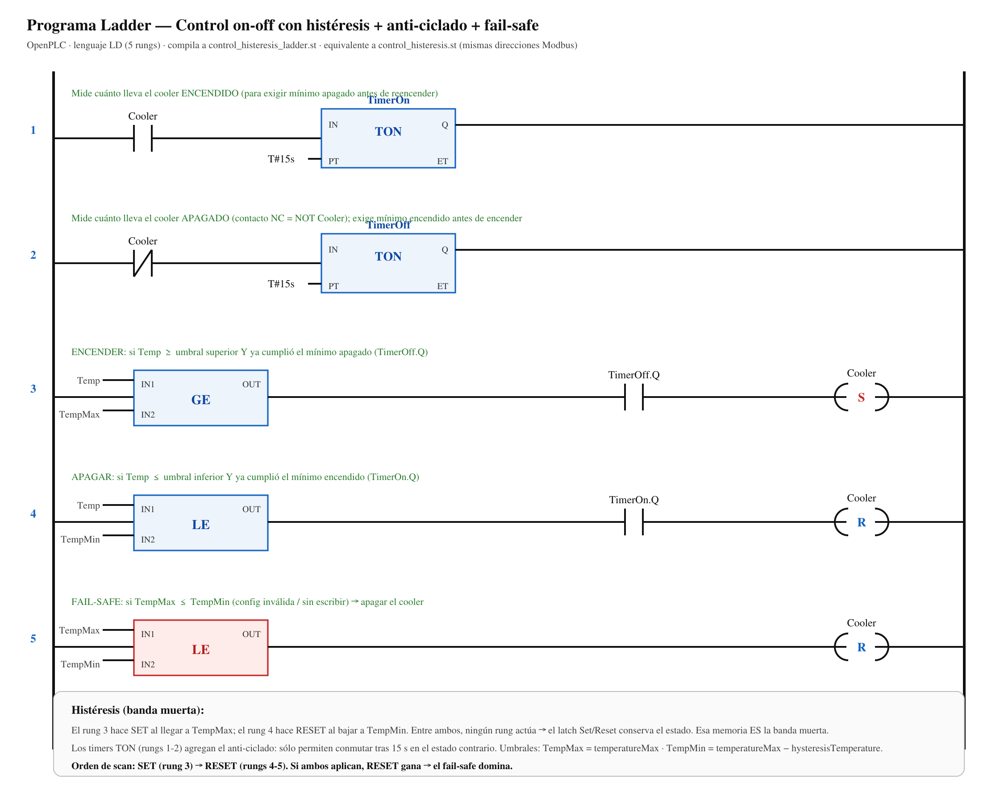

# Control en Ladder (LD) — OpenPLC

Versión en **diagrama de escalera (Ladder / LD, IEC 61131-3)** de la ley de control, equivalente
a [`../control_histeresis.st`](../control_histeresis.st). Demuestra que **la ley de control vive en
OpenPLC** (no en el gateway Python), expresada en el lenguaje gráfico que se enseña en Teoría de
Control. Es la versión **actualmente desplegada** en la Raspberry para la demo.



## Qué hay acá

| Archivo | Qué es |
|---|---|
| `control_histeresis.ld.xml` | **Fuente Ladder** en formato PLCopen TC6 (el mismo XML que consume el compilador de OpenPLC). Es la fuente de verdad del programa LD. |
| `control_histeresis_ladder.st` | **Texto Estructurado compilado** desde el Ladder (via `xml2st`). Es lo que se sube al runtime OpenPLC. |
| `diagrama-ladder.svg` / `.png` | Diagrama del programa (5 rungs) para documentación / exposición. |
| `screenshots/` | Capturas de OpenPLC Editor (construcción) y del Monitoring corriendo. |

## Los 5 rungs

```
1)  Cooler        ─┤ ├─►[ TON TimerOn  PT=15s ]        (mide tiempo ENCENDIDO)
2)  Cooler        ─┤/├─►[ TON TimerOff PT=15s ]        (mide tiempo APAGADO, NC = NOT Cooler)
3)  [GE Temp,TempMax]──┤ TimerOff.Q ├──( S ) Cooler    (ENCENDER con anti-ciclado)
4)  [LE Temp,TempMin]──┤ TimerOn.Q  ├──( R ) Cooler    (APAGAR con anti-ciclado)
5)  [LE TempMax,TempMin]───────────────( R ) Cooler    (FAIL-SAFE: config inválida → apagar)
```

- **Histéresis (banda muerta):** el rung 3 hace *set* al llegar a `TempMax`; el rung 4 hace *reset*
  al bajar a `TempMin`. Entre ambos umbrales ningún rung actúa → el latch Set/Reset conserva el
  estado anterior. Esa memoria **es** la banda muerta.
- **Anti-ciclado:** los `TON` (rungs 1-2) exigen ≥ 15 s en el estado contrario antes de conmutar,
  protegiendo el relé.
- **Fail-safe:** el rung 5 fuerza *reset* si `TempMax ≤ TempMin`. Como corre después del *set* en el
  mismo scan, el fail-safe domina.

Mismas direcciones Modbus que el `.st` de referencia (ver [`../README.md`](../README.md)). Única
diferencia funcional: esta versión **no computa la palabra `Estado` (`%QW10`)**, que era sólo
telemetría de log local en el gateway y no se envía al backend/frontend.

## Alcance del control: sólo temperatura (la humedad es monitoreo)

El lazo **actúa únicamente sobre la temperatura**. Los registros de humedad (`Hum` `%QW1`,
`HumMin` `%QW4`, `HumMax` `%QW5`) se **leen y publican como telemetría**, pero **ningún rung los
usa**: las tres comparaciones del programa (`GE`/`LE`) operan sólo sobre `Temp`, `TempMin` y
`TempMax`.

El motivo es físico: en este trabajo el **único actuador es un cooler**, que actúa sobre la
temperatura. **No contábamos con un humidificador ni deshumidificador**, así que la humedad no
tiene ningún elemento final que pueda modificarla — no sería un lazo de control sino una lectura sin
acción. Por eso la humedad se **mide y se alarma si sale de rango** (en la web), pero **no
realimenta el control**.

Los registros `HumMin`/`HumMax` quedan en el mapa Modbus para tener un **contrato completo** y poder
sumar en el futuro un actuador de humedad (deshumidificador) sin rehacer el mapa; hoy son
telemetría, no variables de control.

## Compilar el Ladder a `.st`

El XML PLCopen se compila con la herramienta `xml2st` que trae OpenPLC Editor:

```bash
# xml2st viene con OpenPLC Editor (resources/bin/xml2st.exe en Windows)
xml2st --generate-st control_histeresis.ld.xml
# genera control_histeresis_ladder.st
```

> **Nota sobre OpenPLC Editor (bug conocido):** al exportar desde el editor gráfico un rung donde
> una bobina cuelga directo de la salida `OUT` de un bloque de función, el editor escribe
> `formalParameter=""` en lugar de `formalParameter="OUT"` en el `plc.xml`, y `xml2st` falla con
> *"No output variable found in block … Connection must be broken"*. Por eso la **fuente de verdad
> es el `.ld.xml`** de esta carpeta (con el `formalParameter` correcto), que compila limpio.

## Desplegar en la Raspberry

En la web de OpenPLC (`http://<ip-pi>:8080`):

1. **Programs → Upload Program** → subir `control_histeresis_ladder.st` → ponerle nombre.
2. Esperar *"Compilation finished successfully"* (el runtime compila con debug → el **Monitoring
   muestra valores** en vivo).
3. **Dashboard → Start PLC**.
4. **Monitoring** → `Temp / TempMin / TempMax / Cooler` con valores reales del gateway.

El gateway (`../gateway.py`) no cambia: mismo contrato Modbus.
